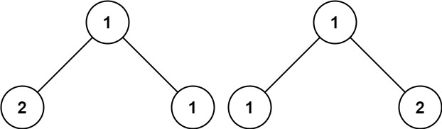

## Problem

Given the roots of two binary trees p and q, write a function to check if they are the same or not.

Two binary trees are considered the same if they are structurally identical, and the nodes have the same value.

Example 1:

Input: p = [1,2,3], q = [1,2,3]
Output: true
Example 2:

Input: p = [1,2], q = [1,null,2]
Output: false
Example 3:

Input: p = [1,2,1], q = [1,1,2]
Output: false

Constraints:

The number of nodes in both trees is in the range [0, 100].
-104 <= Node.val <= 104

## Approach

We use Depth-First Search (DFS) recursion.

To determine if two binary trees are the same:

1. If both nodes are null → they are equal.
2. If one is null and the other is not → not equal.
3. If their values differ → not equal.
4. Recursively check:
    - Left subtrees
    - Right subtrees

Both structure and values must match.

Time: O(n)
We visit each node once.

Space: O(h)
Where h is the height of the tree.
Worst case (skewed tree): O(n)
Best case (balanced tree): O(log n)

