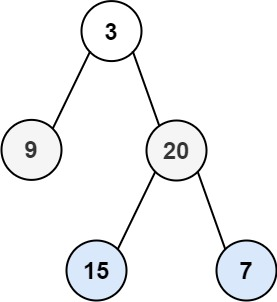

## Problem

Given the root of a binary tree, return the zigzag level order traversal of its nodes' values. (i.e., from left to right, then right to left for the next level and alternate between).


Example 1:


Input: root = [3,9,20,null,null,15,7]
Output: [[3],[20,9],[15,7]]
Example 2:

Input: root = [1]
Output: [[1]]
Example 3:

Input: root = []
Output: []


Constraints:

The number of nodes in the tree is in the range [0, 2000].
-100 <= Node.val <= 100

# Intuition

This problem is very similar to normal Level Order Traversal.

The only difference is that the direction of traversal changes after every level:

- Level 1 → Left to Right
- Level 2 → Right to Left
- Level 3 → Left to Right
- and so on.

A Breadth-First Search (BFS) still naturally processes nodes level by level. The only additional task is handling the alternating order of insertion.

Instead of changing how nodes are visited, we simply change how their values are stored for each level.

---

# Approach

- Use a queue to perform a standard level order traversal.
- Maintain a variable representing the current direction:
    - `1` for Left → Right
    - `-1` for Right → Left
- For every level:
    - Process exactly the number of nodes currently present in the queue.
    - If the direction is left to right, append values normally.
    - Otherwise, insert values at the beginning of the current level's list.
- Add all children of the processed nodes to the queue.
- After completing a level, reverse the direction for the next level.

This allows us to process the tree level by level while producing the required zigzag ordering.

---

# Why Does This Work?

The queue guarantees that nodes are visited level by level in the correct order.

At the beginning of each iteration, the queue contains exactly the nodes belonging to the current level.

The zigzag requirement only changes the **output order** of values within a level, not the order in which nodes should be explored.

By alternating the insertion direction after every level:

- Odd levels are stored from left to right.
- Even levels are stored from right to left.

Since every node is processed exactly once and every level independently determines its insertion direction, the final traversal satisfies the zigzag ordering.

---

# Dry Run

### Input

```
        3
       / \
      9   20
         /  \
        15   7
```

### Level 1 (Left → Right)

Queue:

```
[3]
```

Output:

```
[3]
```

Children added:

```
[9, 20]
```

---

### Level 2 (Right → Left)

Queue:

```
[9, 20]
```

Values are inserted in reverse order.

Output:

```
[20, 9]
```

Children added:

```
[15, 7]
```

---

### Level 3 (Left → Right)

Queue:

```
[15, 7]
```

Output:

```
[15, 7]
```

---

### Final Answer

```
[
  [3],
  [20, 9],
  [15, 7]
]
```

---

# Complexity Analysis

- **Time Complexity:** `O(n)`
    - Every node is visited exactly once.

- **Space Complexity:** `O(n)`
    - The queue may store all nodes of the widest level, and the final answer also stores all node values.