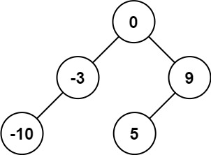
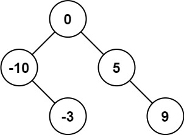
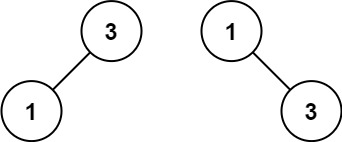

## Problem

Given an integer array nums where the elements are sorted in ascending order, convert it to a height-balanced binary search tree.

Example 1:

Input: nums = [-10,-3,0,5,9]
Output: [0,-3,9,-10,null,5]
Explanation: [0,-10,5,null,-3,null,9] is also accepted:

Example 2:

Input: nums = [1,3]
Output: [3,1]
Explanation: [1,null,3] and [3,1] are both height-balanced BSTs.

Constraints:

1 <= nums.length <= 104
-104 <= nums[i] <= 104
nums is sorted in a strictly increasing order.

## Approach

The goal is to convert a **sorted array** into a **height-balanced Binary Search Tree (BST)**.

### Key Insight

For a BST to remain **balanced**, the **middle element** of the array should be chosen as the root.  
This ensures the left and right subtrees have roughly the same number of nodes.

### Divide and Conquer Strategy

1. Pick the **middle index** of the current range:

   mid = left + (right - left) / 2

2. Create a `TreeNode` with value `nums[mid]`.

3. Recursively construct the **left subtree** using the left half of the array:

   range → `[left, mid - 1]`

4. Recursively construct the **right subtree** using the right half:

   range → `[mid + 1, right]`

5. Stop recursion when the range becomes invalid.

### Implementation Detail

Instead of explicitly checking `left > right`, this implementation avoids unnecessary calls using:

- `if (mid != left)` before building the left subtree
- `if (mid != right)` before building the right subtree

This ensures recursion only happens when elements exist in that range.

### Result

The constructed tree satisfies both properties:

- **Binary Search Tree property**  
  Left subtree values < root < right subtree values.

- **Height-balanced property**  
  Each subtree is built from halves of the array.

---

## Complexity

### Time Complexity
O(n)

Each element of the array is used exactly once to create a tree node.

### Space Complexity
O(log n)

The recursion depth corresponds to the height of the balanced BST, which is `log n`.

