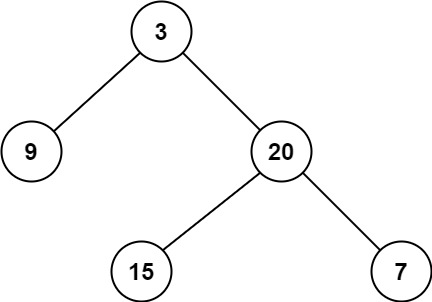

## Problem
Given a binary tree, find its minimum depth.

The minimum depth is the number of nodes along the shortest path from the root node down to the nearest leaf node.

Note: A leaf is a node with no children.

Example 1:

Input: root = [3,9,20,null,null,15,7]

Output: 2

Example 2:

Input: root = [2,null,3,null,4,null,5,null,6]

Output: 5

Constraints:

The number of nodes in the tree is in the range [0, 105].
-1000 <= Node.val <= 1000

## Approach

The goal is to find the **minimum depth** of a binary tree, defined as the number of nodes along the shortest path from the root to a **leaf node**.

### Key Idea: Breadth-First Search (BFS)

We use **level-order traversal (BFS)** because:

- BFS explores nodes level by level
- The **first leaf node encountered** is guaranteed to be at the minimum depth

---

### Step-by-step reasoning

1. **Base Case**

If the root is `null`, return `0`.

---

2. **Initialize BFS**

- Use a queue and add the root node
- Initialize `depth = 0`

---

3. **Level-order traversal**

While the queue is not empty:

- Get the number of nodes at the current level (`n = queue.size()`)

- Process all nodes at this level:
  
  For each node:
  
  - If it is a **leaf node** (both left and right are `null`)
    → return `depth + 1`

  - Otherwise:
    - Add left child (if exists)
    - Add right child (if exists)

---

4. **Move to next level**

After processing all nodes at the current level:

depth++

---

### Why BFS Works Best

- DFS would explore deeper paths unnecessarily
- BFS guarantees we stop at the **first valid leaf**, which is the shortest path

---

### Important Detail

The final `return depth + 1` is technically unnecessary because:

- We always return as soon as we find the first leaf inside the loop

---

## Complexity

### Time Complexity

O(n)

- In the worst case, all nodes are visited

---

### Space Complexity

O(n)

- Queue may contain up to one full level of the tree

