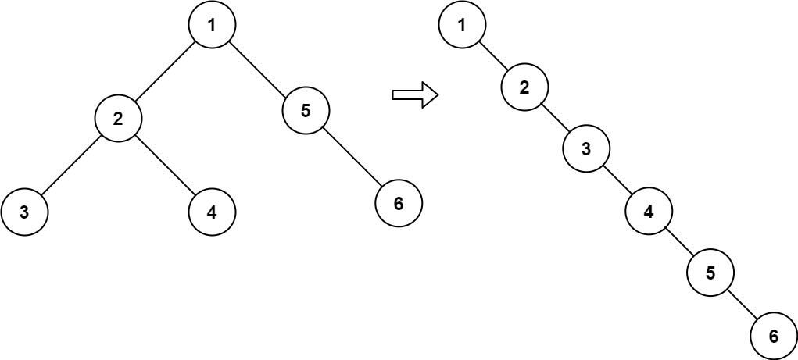

## Problem

Given the root of a binary tree, flatten the tree into a "linked list":

The "linked list" should use the same TreeNode class where the right child pointer points to the next node in the list and the left child pointer is always null.
The "linked list" should be in the same order as a pre-order traversal of the binary tree.

Example 1:

Input: root = [1,2,5,3,4,null,6]

Output: [1,null,2,null,3,null,4,null,5,null,6]

Example 2:

Input: root = []

Output: []

Example 3:

Input: root = [0]

Output: [0]

Constraints:

The number of nodes in the tree is in the range [0, 2000].
-100 <= Node.val <= 100

Follow up: Can you flatten the tree in-place (with O(1) extra space)?

## Approach

**Pattern used:** Tree Transformation (Iterative / Morris-style traversal)

### Core Idea

You want to **flatten the binary tree into a linked list**:

* Follow **preorder traversal (Root → Left → Right)**
* Use **right pointers as next links**
* Set all left pointers to null

👉 Instead of recursion or stack, you do it **in-place**

---

### Step-by-step

1. **Start from root**

* `current = root`

---

2. **Traverse tree**

While `current != null`:

---

3. **If left subtree exists**

* Find the **rightmost node** of left subtree
  (`prev = current.left`, then go `prev.right` till null)

---

4. **Rewire connections**

* Attach original right subtree:
  `prev.right = current.right`

* Move left subtree to right:
  `current.right = current.left`

* Nullify left:
  `current.left = null`

---

5. **Move forward**

* `current = current.right`

---

### Visualization

Before:
1
/
2   5
/ \   
3   4   6

After:
1 → 2 → 3 → 4 → 5 → 6

---

### Key Insights

* You always:

    * Move left subtree to right
    * Append original right subtree at the end
* Finding rightmost node ensures proper chaining
* This mimics preorder traversal without recursion

---

### Subtle Details

* Order is preserved because:

    * Left subtree comes before right
* Must attach right subtree **before overwriting**
* Works like **Morris traversal** (no extra space)

---

### Edge Cases

* Empty tree → no change
* Single node → unchanged
* Left-skewed tree → becomes straight right chain
* Right-skewed tree → already flattened

---

## Complexity

**Time Complexity:** O(n)

* Each node visited at most twice

---

**Space Complexity:** O(1)

* No extra space used

---

## Optimization

Already optimal:

* No recursion stack
* No auxiliary data structures

---

### Alternative

* Recursive preorder → O(n) time, O(h) space
* Stack-based → O(n) time, O(n) space

👉 This is best for space efficiency

---

**Q1:** Why does finding the rightmost node of the left subtree preserve preorder order?
**Q2:** How is this similar to Morris traversal used in inorder traversal?
**Q3:** Can you modify this to flatten the tree in reverse preorder (Right → Left → Root)?

