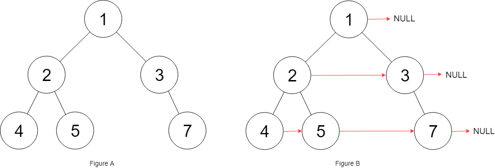

## Problem

Given a binary tree

struct Node {
int val;
Node *left;
Node *right;
Node *next;
}
Populate each next pointer to point to its next right node. If there is no next right node, the next pointer should be set to NULL.

Initially, all next pointers are set to NULL.

Example 1:

Input: root = [1,2,3,4,5,null,7]

Output: [1,#,2,3,#,4,5,7,#]

Explanation: Given the above binary tree (Figure A), your function should populate each next pointer to point to its next right node, just like in Figure B. The serialized output is in level order as connected by the next pointers, with '#' signifying the end of each level.

Example 2:

Input: root = []

Output: []

Constraints:

The number of nodes in the tree is in the range [0, 6000].
-100 <= Node.val <= 100

Follow-up:

You may only use constant extra space.
The recursive approach is fine. You may assume implicit stack space does not count as extra space for this problem.

## Approach

**Pattern used:** DFS + Pointer Linking (Next Right Pointers)

### Core Idea

You are connecting each node’s `next` pointer to its **next right node at the same level**.

Instead of using BFS (queue), this uses:

* Existing `next` pointers to traverse levels
* DFS (right → left) to ensure required links are already available

---

### Step-by-step

1. **Base case**

    * If `root == null` → return null

---

2. **Connect left child**

If `root.left != null`:

* If right child exists:

    * `root.left.next = root.right`
* Else:

    * Find next available node using `findNext(root)`

---

3. **Connect right child**

If `root.right != null`:

* Always:

    * `root.right.next = findNext(root)`

---

4. **Find next node (`findNext`)**

* Traverse using `root.next`
* For each node in same level:

    * If left child exists → return it
    * Else if right child exists → return it
* If none found → return null

---

5. **Recursive order (Important)**

* First: `connect(root.right)`
* Then: `connect(root.left)`

👉 Why?

* Right side must be processed first
* So that `next` pointers are already available when left side needs them

---

### Key Insights

* You reuse `next` pointers → no extra space needed
* Traversing via `root.next` simulates level-order traversal
* Right-first recursion is critical for correctness

---

### Subtle Details

* If you process left first → `findNext` may fail (next chain not built yet)
* `findNext` walks horizontally across the level
* Works for **non-perfect binary trees**

---

### Example

Tree:
1
/
2   3
/     
4       5

Connections:

* 2 → 3
* 4 → 5

---

### Edge Cases

* Empty tree → return null
* Single node → next = null
* Skewed tree → all next pointers null
* Missing children → handled via `findNext`

---

## Complexity

**Time Complexity:** O(n)

* Each node processed once
* `findNext` may traverse across level, but amortized linear

---

**Space Complexity:** O(h)

* Recursion stack (h = height of tree)
* No extra data structures used

---

## Optimization

### Alternative (BFS with Queue)

* Level order traversal
* Connect nodes in same level

Time: O(n)
Space: O(n)

---

### Why this is better

* Uses O(1) extra space (excluding recursion)
* More elegant for this problem

---

**Q1:** Why must we traverse right subtree before left in this approach?
**Q2:** How would this change if the tree was a perfect binary tree?
**Q3:** Can you convert this recursive solution into an iterative one using only pointers?

---------------

## Approach 2

**Pattern used:** Level Order Traversal (Iterative) using Next Pointers (O(1) space)

### Core Idea

Instead of using a queue (BFS), you:

* Traverse each level using existing `next` pointers
* Build the **next level’s connections on the fly**

👉 This simulates BFS without extra space

---

### Step-by-step

1. **Start with current level**

  * `curr = root`

---

2. **Process level by level**

While `curr != null`:

* `head` → start of next level
* `prev` → last processed node in next level

---

3. **Traverse current level**

While `curr != null`:

#### a. Process left child

* If exists:

  * If `prev != null` → connect: `prev.next = curr.left`
  * Else → this is first node → set `head`
  * Move `prev`

---

#### b. Process right child

* Same logic as left child

---

#### c. Move within level

* `curr = curr.next`

---

4. **Move to next level**

* `curr = head`

---

5. **Repeat until all levels processed**

---

### Key Insights

* `next` pointers act like a **linked list for each level**
* You reuse them to traverse horizontally
* `head` tracks the start of next level
* `prev` builds connections for next level

---

### Subtle Details

* `head` must be reset each level
* `prev` ensures continuous linking across nodes
* Works for **non-perfect binary trees**

---

### Example

Tree:
1
/
2   3
/     
4       5

Connections:

* Level 1: 1 → null
* Level 2: 2 → 3 → null
* Level 3: 4 → 5 → null

---

### Edge Cases

* Empty tree → return null
* Single node → next = null
* Skewed tree → works correctly
* Missing children → handled naturally

---

## Complexity

**Time Complexity:** O(n)

* Each node visited once

---

**Space Complexity:** O(1)

* No extra space (excluding input/output)

---

## Optimization

This is **optimal solution**:

* Better than recursive (no stack)
* Better than BFS (no queue)

---

### Comparison

* BFS → O(n) space
* Recursive → O(h) space
* This → O(1) space ✅

---

**Q1:** Why does this approach eliminate the need for a queue compared to BFS?
**Q2:** What role do `head` and `prev` play in maintaining level structure?
**Q3:** How would this approach change if the tree was guaranteed to be perfect?
