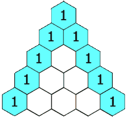

## Problem

Given an integer numRows, return the first numRows of Pascal's triangle.

In Pascal's triangle, each number is the sum of the two numbers directly above it as shown:

Example 1:

Input: numRows = 5
Output: [[1],[1,1],[1,2,1],[1,3,3,1],[1,4,6,4,1]]
Example 2:

Input: numRows = 1
Output: [[1]]

Constraints:

1 <= numRows <= 30

## Approach

The goal is to generate the first `numRows` of **Pascal’s Triangle**.

### Key Idea: Build Row by Row

Each element in Pascal’s Triangle is derived from the **previous row**.

Rule:

value(i, j) = previousRow[j] + previousRow[j - 1]

---

### Step-by-step reasoning

1. Initialize an empty result list.

2. For each row `i` from `0 → numRows - 1`:

   - Create a new row of size `i + 1`

3. Fill elements:

   - First and last elements are always `1`:
     
     if (j == 0 || j == i) → 1

   - Middle elements:
     
     row[j] = previousRow[j] + previousRow[j - 1]

   - Previous row is accessed using:
     
     result.getLast()

---

### Example (numRows = 5)

Row 0 → [1]  
Row 1 → [1, 1]  
Row 2 → [1, 2, 1]  
Row 3 → [1, 3, 3, 1]  
Row 4 → [1, 4, 6, 4, 1]

---

### Why This Works

Each row depends only on the previous row, making it a **dynamic programming pattern**.

We reuse already computed values instead of recomputing combinations.

---

### Important Detail

- `result.getLast()` works only in newer Java versions (Deque-like behavior)
- Otherwise use:

result.get(result.size() - 1)

---

## Complexity

### Time Complexity

O(n²)

- Total elements generated:

1 + 2 + 3 + ... + n = O(n²)

---

### Space Complexity

O(n²)

- Storing all rows of the triangle

