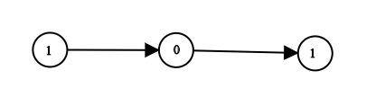

## Problem

Given head which is a reference node to a singly-linked list. The value of each node in the linked list is either 0 or 1. The linked list holds the binary representation of a number.

Return the decimal value of the number in the linked list.

The most significant bit is at the head of the linked list.

Example 1:

Input: head = [1,0,1]

Output: 5

Explanation: (101) in base 2 = (5) in base 10

Example 2:

Input: head = [0]

Output: 0

Constraints:

The Linked List is not empty.
Number of nodes will not exceed 30.
Each node's value is either 0 or 1.

## Approach

**Pattern used:** Linked List Traversal + Bit Manipulation

### Core Idea

The linked list represents a **binary number**, where:

* Each node contains either 0 or 1
* Head is the **most significant bit (MSB)**

You simulate binary-to-decimal conversion while traversing:
👉 Multiply current number by 2 and add the current bit

---

### Step-by-step

1. **Initialize result**

    * `num = 0`

---

2. **Traverse the list**

For each node:

* Shift bits left:
  `num = num * 2`
* Add current bit:
  `num = num + head.val`

👉 Combined:
`num = num * 2 + head.val`

---

3. **Move forward**

* `head = head.next`

---

4. **Return result**

---

### Example

Input:
1 → 0 → 1

Process:

* num = 0 → (0 * 2 + 1) = 1
* num = 1 → (1 * 2 + 0) = 2
* num = 2 → (2 * 2 + 1) = 5

Output: 5

---

### Key Insights

* This is equivalent to **left shift + OR**
  👉 `num = (num << 1) | head.val`
* Works because binary numbers are positional (base 2)
* No need to store bits separately

---

### Subtle Details

* Order matters: MSB comes first
* Using multiplication avoids explicit bit operations (cleaner)

---

### Edge Cases

* Empty list → returns 0
* Single node → returns 0 or 1
* All zeros → returns 0

---

## Complexity

**Time Complexity:** O(n)

* Traverse each node once

---

**Space Complexity:** O(1)

* No extra space used

---

## Optimization

### Bitwise Version (Cleaner)

Instead of multiplication:

* Use:
  `num = (num << 1) | head.val`

Same complexity, but:

* More aligned with bit manipulation concept
* Slightly faster at low level

---

**Q1:** Why does left shift correspond to multiplying by 2 in binary?
**Q2:** What would change if the least significant bit came first in the list?
**Q3:** How would you handle very large lists where the result exceeds integer limits?

