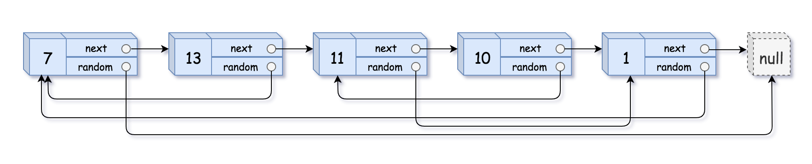

## Problem

A linked list of length n is given such that each node contains an additional random pointer, which could point to any node in the list, or null.

Construct a deep copy of the list. The deep copy should consist of exactly n brand new nodes, where each new node has its value set to the value of its corresponding original node. Both the next and random pointer of the new nodes should point to new nodes in the copied list such that the pointers in the original list and copied list represent the same list state. None of the pointers in the new list should point to nodes in the original list.

For example, if there are two nodes X and Y in the original list, where X.random --> Y, then for the corresponding two nodes x and y in the copied list, x.random --> y.

Return the head of the copied linked list.

The linked list is represented in the input/output as a list of n nodes. Each node is represented as a pair of [val, random_index] where:

val: an integer representing Node.val
random_index: the index of the node (range from 0 to n-1) that the random pointer points to, or null if it does not point to any node.
Your code will only be given the head of the original linked list.

Example 1:

Input: head = [[7,null],[13,0],[11,4],[10,2],[1,0]]
Output: [[7,null],[13,0],[11,4],[10,2],[1,0]]

Example 2:

Input: head = [[1,1],[2,1]]
Output: [[1,1],[2,1]]

Example 3:

Input: head = [[3,null],[3,0],[3,null]]
Output: [[3,null],[3,0],[3,null]]

Constraints:

0 <= n <= 1000
-104 <= Node.val <= 104
Node.random is null or is pointing to some node in the linked list.

## Approach

The goal is to create a **deep copy** of a linked list where each node contains:

- `next` pointer → points to the next node
- `random` pointer → points to any node in the list or `null`

A deep copy means the new list must contain **entirely new nodes**, while preserving both the `next` and `random` relationships.

### Key Idea: HashMap Mapping

We use a `HashMap` to store the relationship between:

original node → copied node

This allows us to easily assign the correct `next` and `random` pointers later.

### Step-by-step reasoning

1. **First Pass – Create all nodes**

   Traverse the original list and create a new node for each original node.

   Store the mapping:

   originalNode → newNode

   This ensures every node already exists when we later assign pointers.

2. **Second Pass – Assign pointers**

   Traverse the list again.

   For each original node:
   - Set `newNode.next` using `map.get(originalNode.next)`
   - Set `newNode.random` using `map.get(originalNode.random)`

   If `next` or `random` is `null`, the map returns `null`, which is correct.

3. **Return the head of the copied list**

   The copied head is simply:

   map.get(head)

### Why this works

Because every original node has a corresponding copied node stored in the map, we can reconstruct all pointer relationships without confusion.

---

## Complexity

### Time Complexity
O(n)

We traverse the linked list twice.

### Space Complexity
O(n)

A HashMap stores one entry per node.
