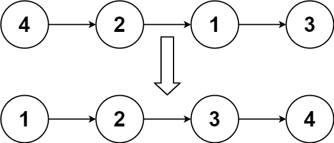
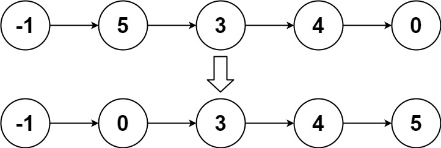

## Problem

Given the head of a linked list, return the list after sorting it in ascending order.

Example 1:

Input: head = [4,2,1,3]

Output: [1,2,3,4]

Example 2:

Input: head = [-1,5,3,4,0]

Output: [-1,0,3,4,5]

Example 3:

Input: head = []

Output: []

Constraints:

The number of nodes in the list is in the range [0, 5 * 104].
-105 <= Node.val <= 105

Follow up: Can you sort the linked list in O(n logn) time and O(1) memory (i.e. constant space)?

## Approach

**Pattern used:** Merge Sort on Linked List

### Core Idea

* Linked lists don’t support random access → quicksort isn’t ideal
* Use **merge sort**, which works efficiently with sequential access

Steps:

1. **Split the list into two halves**
2. **Recursively sort each half**
3. **Merge the sorted halves**

---

### Step-by-step

### 1. Find middle (slow-fast pointers)

* `slow` moves 1 step
* `fast` moves 2 steps
* `prev` tracks node before `slow`

When loop ends:

* `slow` → start of second half
* `prev.next = null` splits the list

---

### 2. Recursive sorting

* Sort left half: `sortList(head)`
* Sort right half: `sortList(slow)`

---

### 3. Merge two sorted lists

Function `sort(left, right)`:

* Use dummy node (`head`)
* Compare values:

    * Attach smaller node
* Move pointers forward
* Append remaining nodes

---

### Key Insights

* Splitting ensures balanced recursion → log n depth
* Merge step ensures sorted order
* No extra array needed (in-place node manipulation)

---

### Subtle Details

* `prev.next = null` is critical
  👉 Without it, infinite recursion

* Using dummy node simplifies merging logic

* Stability:

    * Your merge uses `<`, so equal values come from `right`
    * If stability matters, use `<=`

---

### Edge Cases

* Empty list → return null
* Single node → already sorted
* Duplicate values → handled correctly

---

## Complexity

**Time Complexity:** O(n log n)

* Splitting: log n levels
* Merging: O(n) per level

---

**Space Complexity:** O(log n)

* Recursion stack
* No extra data structures used

---

## Optimization

* Iterative bottom-up merge sort:

    * Removes recursion stack → O(1) space
    * Slightly harder to implement

---

**Q1:** How would you implement bottom-up (iterative) merge sort for linked list?
**Q2:** Why is merge sort preferred over quicksort for linked lists?
**Q3:** How would you modify this to sort in descending order?
