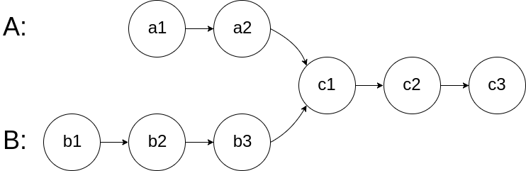
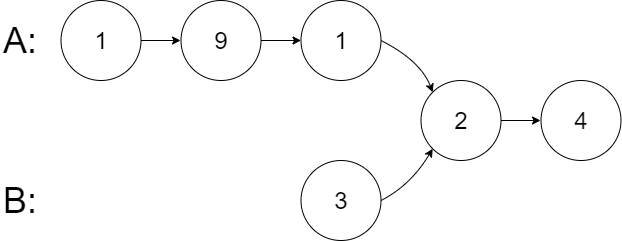
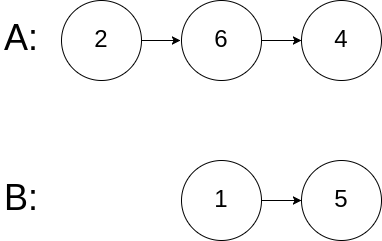

## Problem

Given the heads of two singly linked-lists headA and headB, return the node at which the two lists intersect. If the two linked lists have no intersection at all, return null.

For example, the following two linked lists begin to intersect at node c1:

The test cases are generated such that there are no cycles anywhere in the entire linked structure.

Note that the linked lists must retain their original structure after the function returns.

Custom Judge:

The inputs to the judge are given as follows (your program is not given these inputs):

intersectVal - The value of the node where the intersection occurs. This is 0 if there is no intersected node.
listA - The first linked list.
listB - The second linked list.
skipA - The number of nodes to skip ahead in listA (starting from the head) to get to the intersected node.
skipB - The number of nodes to skip ahead in listB (starting from the head) to get to the intersected node.
The judge will then create the linked structure based on these inputs and pass the two heads, headA and headB to your program. If you correctly return the intersected node, then your solution will be accepted.

Example 1:

Input: intersectVal = 8, listA = [4,1,8,4,5], listB = [5,6,1,8,4,5], skipA = 2, skipB = 3

Output: Intersected at '8'

Explanation: The intersected node's value is 8 (note that this must not be 0 if the two lists intersect).

From the head of A, it reads as [4,1,8,4,5]. From the head of B, it reads as [5,6,1,8,4,5]. There are 2 nodes before the intersected node in A; There are 3 nodes before the intersected node in B.

- Note that the intersected node's value is not 1 because the nodes with value 1 in A and B (2nd node in A and 3rd node in B) are different node references. In other words, they point to two different locations in memory, while the nodes with value 8 in A and B (3rd node in A and 4th node in B) point to the same location in memory.

Example 2:

Input: intersectVal = 2, listA = [1,9,1,2,4], listB = [3,2,4], skipA = 3, skipB = 1

Output: Intersected at '2'

Explanation: The intersected node's value is 2 (note that this must not be 0 if the two lists intersect).

From the head of A, it reads as [1,9,1,2,4]. From the head of B, it reads as [3,2,4]. There are 3 nodes before the intersected node in A; There are 1 node before the intersected node in B.

Example 3:

Input: intersectVal = 0, listA = [2,6,4], listB = [1,5], skipA = 3, skipB = 2

Output: No intersection

Explanation: From the head of A, it reads as [2,6,4]. From the head of B, it reads as [1,5]. Since the two lists do not intersect, intersectVal must be 0, while skipA and skipB can be arbitrary values.
Explanation: The two lists do not intersect, so return null.

Constraints:

The number of nodes of listA is in the m.
The number of nodes of listB is in the n.
1 <= m, n <= 3 * 104
1 <= Node.val <= 105
0 <= skipA <= m
0 <= skipB <= n
intersectVal is 0 if listA and listB do not intersect.
intersectVal == listA[skipA] == listB[skipB] if listA and listB intersect.

Follow up: Could you write a solution that runs in O(m + n) time and use only O(1) memory?

## Approach

**Pattern used:** Two Pointers (Pointer Switching)

### Core Idea

You need to find the **intersection node of two linked lists**.

Instead of calculating lengths or aligning manually, use two pointers that **switch heads** when they reach the end.

👉 This ensures both pointers traverse **equal total distance**

---

### Step-by-step

1. **Initialize pointers**

    * `p1 = headA`
    * `p2 = headB`

---

2. **Traverse both lists**

While `p1 != p2`:

* Move both pointers forward:

    * `p1 = p1.next`
    * `p2 = p2.next`

* If any pointer reaches null:

    * Redirect it to the **other list's head**

---

3. **Why this works**

Let:

* Length of A = m
* Length of B = n
* Intersection starts after some offset

Then:

* p1 travels: A → B (m + n steps)
* p2 travels: B → A (n + m steps)

👉 Both cover same total distance
👉 They align at intersection point

---

4. **Exit condition**

* If intersection exists → both meet at that node
* If no intersection → both become null

Return `p1` (or `p2`)

---

### Key Insights

* No need to calculate lengths
* No extra space required
* Pointer switching equalizes path lengths automatically

---

### Subtle Details

* The trick is **not obvious** but very powerful
* Both pointers will either:

    * Meet at intersection, or
    * Meet at null (no intersection)

---

### Example

A: 1 → 2 → 3 → 7 → 8
B: 4 → 5 → 7 → 8

After switching:

* Both pointers align at node 7

---

### Edge Cases

* No intersection → return null
* One list empty → return null
* Intersection at head → immediate match
* Different lengths → handled automatically

---

## Complexity

**Time Complexity:** O(m + n)

* Each pointer traverses both lists once

---

**Space Complexity:** O(1)

* No extra space used

---

## Optimization

Already optimal:

* Single pass
* Constant space

Alternative (less optimal):

* Use HashSet to store nodes of one list → O(n) space

---

**Q1:** Why does switching heads guarantee both pointers travel equal distance?
**Q2:** How would you solve this if modifying the list structure was allowed?
**Q3:** Can this technique be applied to detect cycles in linked lists?
