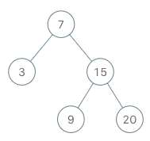

## Problem


Implement the BSTIterator class that represents an iterator over the in-order traversal of a binary search tree (BST):

BSTIterator(TreeNode root) Initializes an object of the BSTIterator class. The root of the BST is given as part of the constructor. The pointer should be initialized to a non-existent number smaller than any element in the BST.
boolean hasNext() Returns true if there exists a number in the traversal to the right of the pointer, otherwise returns false.
int next() Moves the pointer to the right, then returns the number at the pointer.
Notice that by initializing the pointer to a non-existent smallest number, the first call to next() will return the smallest element in the BST.

You may assume that next() calls will always be valid. That is, there will be at least a next number in the in-order traversal when next() is called.


Example 1:




Input

["BSTIterator", "next", "next", "hasNext", "next", "hasNext", "next", "hasNext", "next", "hasNext"]

[[[7, 3, 15, null, null, 9, 20]], [], [], [], [], [], [], [], [], []]

Output

[null, 3, 7, true, 9, true, 15, true, 20, false]


Explanation

BSTIterator bSTIterator = new BSTIterator([7, 3, 15, null, null, 9, 20]);
bSTIterator.next();    // return 3
bSTIterator.next();    // return 7
bSTIterator.hasNext(); // return True
bSTIterator.next();    // return 9
bSTIterator.hasNext(); // return True
bSTIterator.next();    // return 15
bSTIterator.hasNext(); // return True
bSTIterator.next();    // return 20
bSTIterator.hasNext(); // return False


Constraints:

The number of nodes in the tree is in the range [1, 105].
0 <= Node.val <= 106
At most 105 calls will be made to hasNext, and next.


Follow up:

Could you implement next() and hasNext() to run in average O(1) time and use O(h) memory, where h is the height of the tree?


# Intuition

A Binary Search Tree (BST) stores its elements in sorted order when traversed using **Inorder Traversal** (Left → Root → Right).

Instead of performing the entire inorder traversal beforehand, we can simulate it **lazily**, processing only the nodes required for the current operation.

A stack helps us remember the path to the next smallest element while avoiding the need to store the entire traversal.

---

# Approach

- During initialization:
    - Traverse from the root to the leftmost node.
    - Push every visited node onto the stack.
    - The top of the stack becomes the smallest element in the BST.

- For the `next()` operation:
    - Pop the top node from the stack, as it is the next smallest element.
    - If this node has a right child:
        - Move to its right subtree.
        - Push the right child and all of its left descendants onto the stack.
    - Return the popped node's value.

- For the `hasNext()` operation:
    - Simply check whether the stack is empty.
    - If the stack contains nodes, another smallest element is available.

---

# Why Does This Work?

The stack always stores the path to the next smallest unvisited node.

Initially, pushing all left descendants places the smallest element on top of the stack.

Whenever a node is removed:

- Its left subtree has already been completely processed.
- The node itself is now the next smallest element.
- If a right subtree exists, its leftmost node becomes the next smallest element, so all left descendants of the right child are pushed onto the stack.

Thus, every node is visited exactly once in ascending order, producing the same sequence as an inorder traversal without storing all values beforehand.

---

# Dry Run

### Input

```
        7
       / \
      3   15
         /  \
        9   20
```

### Initialization

Push all left descendants:

| Action | Stack (Bottom → Top) |
|--------|-----------------------|
| Push 7 | [7] |
| Push 3 | [7, 3] |

Top of the stack is `3`.

### Operations

| Operation | Returned Value | Stack After Operation |
|-----------|---------------:|-----------------------|
| next() | 3 | [7] |
| next() | 7 | [15, 9] |
| next() | 9 | [15] |
| next() | 15 | [20] |
| next() | 20 | [] |

The returned sequence is:

```
3 → 7 → 9 → 15 → 20
```

which is the inorder traversal of the BST.

---

# Complexity Analysis

- **Time Complexity:**
    - **BSTIterator():** `O(h)` where `h` is the height of the tree, since only the leftmost path is pushed.
    - **next():** `O(1)` amortized. Although pushing a right subtree may take `O(h)` in one call, each node is pushed and popped exactly once over the entire traversal.
    - **hasNext():** `O(1)`.

- **Space Complexity:** `O(h)`
    - The stack stores at most one root-to-leaf path, where `h` is the height of the BST.