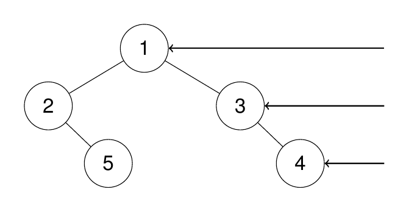
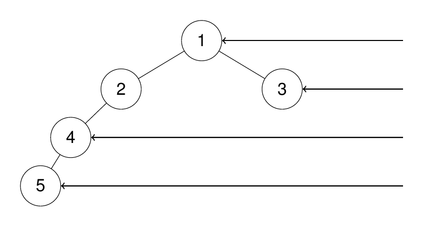

## Problem

Given the root of a binary tree, imagine yourself standing on the right side of it, return the values of the nodes you can see ordered from top to bottom.

Example 1:

Input: root = [1,2,3,null,5,null,4]

Output: [1,3,4]

Explanation:

Example 2:

Input: root = [1,2,3,4,null,null,null,5]

Output: [1,3,4,5]

Explanation:

Example 3:

Input: root = [1,null,3]

Output: [1,3]

Example 4:

Input: root = []

Output: []

Constraints:

The number of nodes in the tree is in the range [0, 100].
-100 <= Node.val <= 100

## Approach

**Pattern used:** DFS (Preorder variant) + Level Tracking

### Core Idea

You want the **rightmost node at each level** (what’s visible from the right side).

Key trick:
👉 Traverse **right first, then left**

This ensures:

* The first node you visit at each depth is the **rightmost node**

---

### Step-by-step

1. **Start DFS**

    * Pass:

        * `root`
        * `result list`
        * `depth = 0`

---

2. **Base case**

    * If node is null → return

---

3. **Check first visit at this depth**

* If:
  `depth == result.size()`

👉 This means:

* You are visiting this level for the **first time**

* Add current node value:
  `result.add(root.val)`

---

4. **Traverse right first**

* `dfs(root.right, ..., depth + 1)`

---

5. **Then traverse left**

* `dfs(root.left, ..., depth + 1)`

---

### Key Insights

* Right-first traversal ensures:
  👉 Rightmost node is seen first at each level
* `result.size()` acts like a **level tracker**
* No need for extra structures like maps or queues

---

### Example

Tree:
1
/
2   3
\   
5   4

DFS order:
1 → 3 → 4 → 2 → 5

Result:
[1, 3, 4]

---

### Subtle Details

* If you traverse left first → you’ll get left view instead
* Depth comparison avoids overwriting values
* Only first node per level is recorded

---

### Edge Cases

* Empty tree → []
* Single node → [root]
* Left-skewed tree → all nodes visible
* Right-skewed tree → all nodes visible

---

## Complexity

**Time Complexity:** O(n)

* Each node visited once

---

**Space Complexity:** O(h)

* Recursion stack (h = height of tree)

---

## Optimization

### Alternative: BFS (Level Order)

* Traverse level by level
* Take last node of each level

Time: O(n)
Space: O(n)

---

### Why DFS is better here

* Uses less space (no queue)
* Elegant and concise

---

**Q1:** Why does visiting right before left guarantee correct result?
**Q2:** How would you modify this to get the left side view?
**Q3:** Can you solve this iteratively using DFS with a stack?

