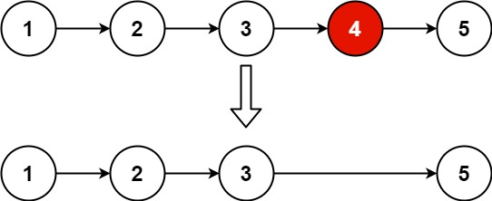

## Problem

Given the head of a linked list, remove the nth node from the end of the list and return its head.

Example 1:

Input: head = [1,2,3,4,5], n = 2

Output: [1,2,3,5]

Example 2:

Input: head = [1], n = 1

Output: []

Example 3:

Input: head = [1,2], n = 1

Output: [1]

Constraints:

The number of nodes in the list is sz.
1 <= sz <= 30
0 <= Node.val <= 100
1 <= n <= sz

## Approach

**Pattern used:** Two Pointers (Fast & Slow) + Dummy Node

### Core Idea

To remove the **nth node from the end**, you need to locate it without knowing the list length upfront.

Use two pointers:

* Move `fast` ahead by **n+1 steps**
* Then move both `slow` and `fast` together
* When `fast` reaches null, `slow` will be **just before the node to delete**

---

### Step-by-step

1. **Create dummy node**

    * `start → head`
    * Handles edge case where head itself needs to be removed

2. **Initialize pointers**

    * `slow = start`
    * `fast = start`

---

3. **Move fast pointer ahead by (n + 1) steps**

    * This creates a gap of n nodes between slow and fast

---

4. **Move both pointers together**

    * Continue until `fast == null`
    * Now:

        * `slow` is at node **just before target**

---

5. **Delete the node**

    * `slow.next = slow.next.next`

---

6. **Return result**

    * `start.next` (handles head removal correctly)

---

### Key Insights

* Gap of **n+1** ensures correct positioning
* Dummy node avoids special handling when deleting head
* Single pass solution → efficient

---

### Subtle Details

* Loop runs `n + 1` times (not n)

    * This ensures slow lands **before** the node to remove
* If you used only n steps → off-by-one error

---

### Edge Cases

* Removing head (n == list length) → handled by dummy node
* Single node list → becomes empty
* n == 1 → remove last node
* n equals list length → remove first node

---

## Complexity

**Time Complexity:** O(n)

* Single traversal of list

---

**Space Complexity:** O(1)

* No extra space used

---

## Optimization

This is already optimal:

* Single pass
* Constant space

Alternative (less optimal):

* Two-pass solution (first count length, then remove)
* Simpler but O(2n)

---

**Q1:** What happens if you move fast only n steps instead of n+1?
**Q2:** How would you modify this for a doubly linked list?
**Q3:** Can you solve this recursively, and what trade-offs would that introduce?

 