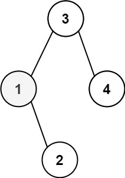
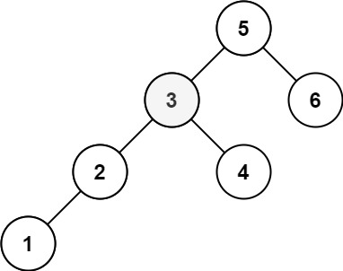

## Problem

Given the root of a binary search tree, and an integer k, return the kth smallest value (1-indexed) of all the values of the nodes in the tree.


Example 1:



Input: root = [3,1,4,null,2], k = 1
Output: 1

Example 2:



Input: root = [5,3,6,2,4,null,null,1], k = 3
Output: 3


Constraints:

The number of nodes in the tree is n.
1 <= k <= n <= 104
0 <= Node.val <= 104


Follow up: If the BST is modified often (i.e., we can do insert and delete operations) and you need to find the kth smallest frequently, how would you optimize?


# Intuition

A Binary Search Tree (BST) has a very important property:

- All nodes in the left subtree are smaller than the current node.
- All nodes in the right subtree are larger than the current node.

Because of this property, an **Inorder Traversal (Left → Root → Right)** visits the nodes in **sorted order**.

Therefore, the problem reduces to:

> Find the `k`-th element in the inorder traversal of the BST.

Instead of storing the entire traversal, we can simply count how many nodes have been visited during the inorder traversal. As soon as the count becomes `k`, we have found the answer.

---

# Approach

- Perform an inorder traversal of the BST.
- Maintain a counter representing the number of nodes visited so far.
- Traverse the left subtree first.
- After returning from the left subtree:
    - Increment the counter.
    - If the counter becomes equal to `k`, store the current node's value as the answer.
- Traverse the right subtree.

Once the answer is found, stop further recursive calls since additional traversal is unnecessary.

---

# Why Does This Work?

Inorder traversal of a BST always produces the nodes in ascending order.

Suppose the inorder traversal sequence is:

```
v1 < v2 < v3 < ... < vn
```

The first visited node is the smallest element, the second visited node is the second smallest element, and so on.

Therefore:

- The `k`-th visited node during inorder traversal is exactly the `k`-th smallest element in the BST.

The early stopping condition ensures that once the answer is found, the remaining parts of the tree are not explored unnecessarily.

Since every node before the `k`-th smallest element must be visited, the algorithm correctly returns the desired value.

---

# Dry Run

### Input

```
        5
       / \
      3   6
     / \
    2   4
   /
  1

k = 3
```

### Inorder Traversal Order

```
1 → 2 → 3 → 4 → 5 → 6
```

| Visited Node | Count | Answer |
|-------------:|-------:|--------:|
| 1 | 1 | - |
| 2 | 2 | - |
| 3 | 3 | 3 |

As soon as the count becomes `3`, we stop the traversal.

Final answer:

```
3
```

---

# Complexity Analysis

- **Time Complexity:** `O(h + k)`
    - In the best and average cases, we only visit nodes necessary to reach the `k`-th smallest element.
    - In the worst case, when `k = n`, every node may be visited, resulting in `O(n)`.

- **Space Complexity:** `O(h)`
    - The recursion stack stores at most one root-to-leaf path, where `h` is the height of the BST.
    - In the worst case of a skewed tree, this becomes `O(n)`.