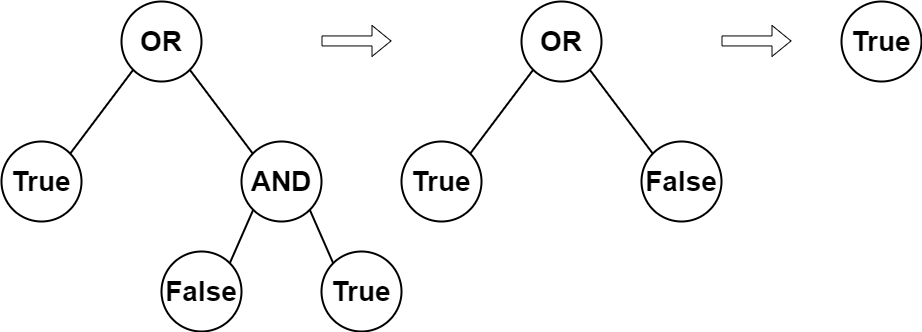

## Problem
You are given the root of a full binary tree with the following properties:

Leaf nodes have either the value 0 or 1, where 0 represents False and 1 represents True.
Non-leaf nodes have either the value 2 or 3, where 2 represents the boolean OR and 3 represents the boolean AND.
The evaluation of a node is as follows:

If the node is a leaf node, the evaluation is the value of the node, i.e. True or False.
Otherwise, evaluate the node's two children and apply the boolean operation of its value with the children's evaluations.
Return the boolean result of evaluating the root node.

A full binary tree is a binary tree where each node has either 0 or 2 children.

A leaf node is a node that has zero children.

Example 1:

Input: root = [2,1,3,null,null,0,1]

Output: true

Explanation: The above diagram illustrates the evaluation process.

The AND node evaluates to False AND True = False.

The OR node evaluates to True OR False = True.

The root node evaluates to True, so we return true.

Example 2:

Input: root = [0]

Output: false

Explanation: The root node is a leaf node and it evaluates to false, so we return false.

Constraints:

The number of nodes in the tree is in the range [1, 1000].
0 <= Node.val <= 3

Every node has either 0 or 2 children.

Leaf nodes have a value of 0 or 1.

Non-leaf nodes have a value of 2 or 3.

## Approach

The tree represents a **boolean expression**, where:

- Leaf nodes:
  - `0` → false
  - `1` → true

- Internal nodes:
  - `2` → OR operation
  - `3` → AND operation

---

### Key Idea: Recursive Evaluation (Postorder DFS)

We evaluate the tree **bottom-up**:

- First evaluate left and right subtrees
- Then apply the operation at the current node

---

### Step-by-step reasoning

1. **Base Case (Leaf Node)**

If the node has no children:

- Return `true` if value is `1`
- Return `false` if value is `0`

---

2. **Recursive Case (Internal Node)**

- If `val == 2` (OR):
  
  return left OR right

- If `val == 3` (AND):
  
  return left AND right

---

3. Recursively evaluate:

evaluateTree(root.left)  
evaluateTree(root.right)

---

### Why This Works

- Each subtree represents a valid boolean expression
- Recursively solving smaller expressions leads to the final result
- This is equivalent to evaluating an **expression tree**

---

## Complexity

### Time Complexity

O(n)

- Each node is visited exactly once

---

### Space Complexity

O(h)

- `h` = height of the tree
- Due to recursion stack

