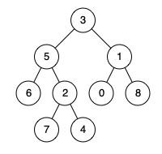

## Problem

Given a binary tree, find the lowest common ancestor (LCA) of two given nodes in the tree.

According to the definition of LCA on Wikipedia: “The lowest common ancestor is defined between two nodes p and q as the lowest node in T that has both p and q as descendants (where we allow a node to be a descendant of itself).”


Example 1:



Input: root = [3,5,1,6,2,0,8,null,null,7,4], p = 5, q = 1

Output: 3

Explanation: The LCA of nodes 5 and 1 is 3.

Example 2:


Input: root = [3,5,1,6,2,0,8,null,null,7,4], p = 5, q = 4

Output: 5

Explanation: The LCA of nodes 5 and 4 is 5, since a node can be a descendant of itself according to the LCA definition.


Example 3:


Input: root = [1,2], p = 1, q = 2

Output: 1


Constraints:

The number of nodes in the tree is in the range [2, 105].
-109 <= Node.val <= 109
All Node.val are unique.
p != q
p and q will exist in the tree.


# Intuition

The Lowest Common Ancestor (LCA) of two nodes is the **lowest node in the tree that has both nodes as descendants** (where a node can also be a descendant of itself).

Instead of searching for paths from the root to both nodes, we can use recursion to determine where the target nodes are located.

For every node, there are three possibilities:

- Both target nodes are in the left subtree.
- Both target nodes are in the right subtree.
- One target node is in each subtree.

The third case identifies the current node as the Lowest Common Ancestor.

---

# Approach

Perform a Depth-First Search (DFS) on the tree.

For each node:

1. If the current node is `null`, return `null`.
2. If the current node matches either `p` or `q`, return the current node.
3. Recursively search the left subtree.
4. Recursively search the right subtree.

After both recursive calls:

- If both left and right return a non-null node, the current node is the first place where the two targets meet, so it is the Lowest Common Ancestor.
- If only one side returns a non-null node, propagate that node upward.
- If both sides return `null`, propagate `null`.

The recursive calls continue until the root receives the final answer.

---

# Why Does This Work?

Each recursive call returns one of three values:

- `null` if neither target node exists in that subtree.
- One of the target nodes (or their Lowest Common Ancestor) if found in that subtree.
- The Lowest Common Ancestor itself once both targets have been discovered.

If one target is found in the left subtree and the other in the right subtree, the current node is the first node that connects both paths, making it the Lowest Common Ancestor.

If both targets lie entirely within one subtree, that subtree will eventually determine the Lowest Common Ancestor and propagate it upward unchanged.

Since every node is visited exactly once and all possible locations of the target nodes are considered, the algorithm always returns the correct Lowest Common Ancestor.

---

# Dry Run

### Input

```
          3
         / \
        5   1
       / \ / \
      6  2 0  8
        / \
       7   4

p = 5
q = 1
```

| Current Node | Left Result | Right Result | Returned Value |
|-------------:|-------------|--------------|----------------|
| 5 | 5 | null | 5 |
| 1 | null | 1 | 1 |
| 3 | 5 | 1 | 3 |

Final answer:

```
3
```

---

### Another Example

```
          3
         / \
        5   1
       / \
      6   2

p = 5
q = 6
```

| Current Node | Left Result | Right Result | Returned Value |
|-------------:|-------------|--------------|----------------|
| 6 | 6 | null | 6 |
| 5 | 6 | 5 | 5 |
| 3 | 5 | null | 5 |

Final answer:

```
5
```

Here, one of the target nodes (`5`) is an ancestor of the other (`6`), so it is the Lowest Common Ancestor.

---

# Complexity Analysis

- **Time Complexity:** `O(n)`
    - Every node is visited at most once during the DFS traversal.

- **Space Complexity:** `O(h)`
    - The recursion stack stores at most one root-to-leaf path, where `h` is the height of the tree.
    - In the worst case (a skewed tree), this becomes `O(n)`.


