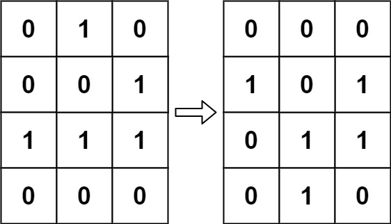
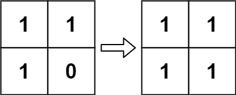

According to Wikipedia's article: "The Game of Life, also known simply as Life, is a cellular automaton devised by the British mathematician John Horton Conway in 1970."

The board is made up of an m x n grid of cells, where each cell has an initial state: live (represented by a 1) or dead (represented by a 0). Each cell interacts with its eight neighbors (horizontal, vertical, diagonal) using the following four rules (taken from the above Wikipedia article):

Any live cell with fewer than two live neighbors dies as if caused by under-population.
Any live cell with two or three live neighbors lives on to the next generation.
Any live cell with more than three live neighbors dies, as if by over-population.
Any dead cell with exactly three live neighbors becomes a live cell, as if by reproduction.
The next state of the board is determined by applying the above rules simultaneously to every cell in the current state of the m x n grid board. In this process, births and deaths occur simultaneously.

Given the current state of the board, update the board to reflect its next state.

Note that you do not need to return anything.

Example 1:

Input: board = [[0,1,0],[0,0,1],[1,1,1],[0,0,0]]
Output: [[0,0,0],[1,0,1],[0,1,1],[0,1,0]]

Example 2:

Input: board = [[1,1],[1,0]]
Output: [[1,1],[1,1]]

Constraints:

m == board.length
n == board[i].length
1 <= m, n <= 25
board[i][j] is 0 or 1.

Follow up:

Could you solve it in-place? Remember that the board needs to be updated simultaneously: You cannot update some cells first and then use their updated values to update other cells.

In this question, we represent the board using a 2D array. In principle, the board is infinite, which would cause problems when the active area encroaches upon the border of the array (i.e., live cells reach the border). How would you address these problems?

# Game of Life

## Approach

**Pattern used:** In-place State Encoding

---

# Core Idea

Each cell depends on:

* current neighbors
* original state of surrounding cells

Problem:
while updating cells,
you must not destroy information needed by future cells.

So instead of using another matrix,
encode:

* old state
* new state
  inside the same cell.

---

# State Encoding

You used:

| Original | New | Encoded |
| -------- | --- | ------- |
| 0        | 0   | 0       |
| 1        | 1   | 1       |
| 0        | 1   | 2       |
| 1        | 0   | 3       |

Important:

* `2` means:
  dead → alive

* `3` means:
  alive → dead

This preserves original information during traversal.

---

# Step-by-step

## 1. Traverse every cell

For each cell:

* count live neighbors
* apply Game of Life rules

---

# Rules

## Live cell

Dies if:

* fewer than 2 neighbors
* more than 3 neighbors

Encoded as:

board[r][c] = 3

Meaning:
alive → dead

---

## Dead cell

Becomes alive if:

* exactly 3 live neighbors

Encoded as:

board[r][c] = 2

Meaning:
dead → alive

---

# 2. Finalize board

After all transitions are marked:

* `2 → 1`
* `3 → 0`

Now board contains final next generation.

---

# Key Insight

This condition is the heart of the solution:

if (board[nr][nc] == 1 || board[nr][nc] == 3)

Why include `3`?

Because:

* `3` was originally alive
* even though it will die later

Neighbor counting must use ORIGINAL state.

Similarly:

* `2` should NOT count as alive
  because originally it was dead.

This is the entire trick.

---

# Why in-place works

At any moment:

| Value | Original State |
| ----- | -------------- |
| 0     | dead           |
| 1     | alive          |
| 2     | dead           |
| 3     | alive          |

So original state is always recoverable.

---

# Complexity

## Time Complexity

Each cell checks 8 neighbors:

O(m \times n)

---

## Space Complexity

Only direction array used:

O(1)

---

# Common Mistake

Wrong neighbor check:

if (board[nr][nc] == 1)

This fails because:

* cells marked `3` were originally alive

Need:

if (board[nr][nc] == 1 || board[nr][nc] == 3)

---

# Alternative Encoding

Some people use:

| State | Meaning      |
| ----- | ------------ |
| -1    | alive → dead |
| 2     | dead → alive |

Same idea.

Your encoding is cleaner and easier to reason about.

---

# Final Take

This is the optimal in-place solution:

* no extra matrix
* preserves original state
* elegant state encoding trick

Classic matrix simulation problem.

---

**Q1:** Why must neighbor counting use original state instead of updated state?
**Q2:** How would you solve this using bit manipulation instead of integer encoding?
**Q3:** How could this be extended to simulate infinite boards efficiently?

