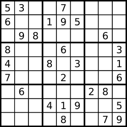

## Problem

Determine if a 9 x 9 Sudoku board is valid. Only the filled cells need to be validated according to the following rules:

Each row must contain the digits 1-9 without repetition.
Each column must contain the digits 1-9 without repetition.
Each of the nine 3 x 3 sub-boxes of the grid must contain the digits 1-9 without repetition.
Note:

A Sudoku board (partially filled) could be valid but is not necessarily solvable.
Only the filled cells need to be validated according to the mentioned rules.

Example 1:

Input: board =
[["5","3",".",".","7",".",".",".","."]
,["6",".",".","1","9","5",".",".","."]
,[".","9","8",".",".",".",".","6","."]
,["8",".",".",".","6",".",".",".","3"]
,["4",".",".","8",".","3",".",".","1"]
,["7",".",".",".","2",".",".",".","6"]
,[".","6",".",".",".",".","2","8","."]
,[".",".",".","4","1","9",".",".","5"]
,[".",".",".",".","8",".",".","7","9"]]
Output: true
Example 2:

Input: board =
[["8","3",".",".","7",".",".",".","."]
,["6",".",".","1","9","5",".",".","."]
,[".","9","8",".",".",".",".","6","."]
,["8",".",".",".","6",".",".",".","3"]
,["4",".",".","8",".","3",".",".","1"]
,["7",".",".",".","2",".",".",".","6"]
,[".","6",".",".",".",".","2","8","."]
,[".",".",".","4","1","9",".",".","5"]
,[".",".",".",".","8",".",".","7","9"]]
Output: false
Explanation: Same as Example 1, except with the 5 in the top left corner being modified to 8. Since there are two 8's in the top left 3x3 sub-box, it is invalid.

Constraints:

board.length == 9
board[i].length == 9
board[i][j] is a digit 1-9 or '.'.

## Approach 1

The goal is to determine whether a **9 × 9 Sudoku board** is valid according to three rules:

1. Each **row** must contain digits `1–9` without repetition.
2. Each **column** must contain digits `1–9` without repetition.
3. Each **3 × 3 sub-box** must contain digits `1–9` without repetition.

Empty cells are represented by `'.'` and are ignored during validation.

---

## Step 1 — Validate 3×3 Boxes

The board is divided into **nine 3×3 sub-boxes**.

To check each box:

- Iterate through the board with a step of `3`.
- For each starting coordinate `(row, col)`:
  - Traverse the 3×3 region.
  - Use a `HashSet` to track digits encountered.
  - If a digit already exists in the set, the box is invalid.

Box traversal range:

row → `row` to `row + 2`  
col → `col` to `col + 2`

If any duplicate is found, return `false`.

---

## Step 2 — Validate Rows and Columns

For each index `i`:

- Validate **column `i`**
- Validate **row `i`**

### Column Validation

Start at `(row, col)` and check all elements above and below using a set to detect duplicates.

### Row Validation

Reset the set and check all elements to the left and right in the same row.

During both checks:

- Ignore `'.'`
- If inserting a digit into the set fails, a duplicate exists.

---

## Step 3 — Final Result

If all boxes, rows, and columns pass the validation checks, the Sudoku board is valid.

---

## Complexity 1

### Time Complexity
O(1)

The board size is fixed at **9 × 9**, so the number of operations is constant.

More generally (for an `n × n` Sudoku):

O(n²)

---

### Space Complexity
O(1)

The sets store at most **9 digits** at a time, which is constant space.

## Approach 2

The goal is to verify whether a **9 × 9 Sudoku board** is valid according to three rules:

1. Each **row** must contain digits `1–9` without repetition.
2. Each **column** must contain digits `1–9` without repetition.
3. Each **3 × 3 sub-box** must contain digits `1–9` without repetition.

Instead of using `HashSet`s repeatedly, this solution uses **three boolean matrices** to track which digits have already appeared.

---

### Data Structures

Three boolean arrays are used:

rows[9][9]  
cols[9][9]  
boxes[9][9]

Meaning:

- `rows[i][d]` → digit `d+1` already exists in row `i`
- `cols[j][d]` → digit `d+1` already exists in column `j`
- `boxes[b][d]` → digit `d+1` already exists in box `b`

Digits are mapped from `'1'..'9'` to index `0..8`:

digitIndex = board[i][j] - '1'

---

### Identifying the 3×3 Box

Each cell belongs to one of the **9 boxes**.  
The box index is calculated as:

boxIndex = (i / 3) * 3 + (j / 3)

This converts the 3×3 grid of boxes into a single index from **0 to 8**.

Example box layout:

0 1 2  
3 4 5  
6 7 8  

---

### Algorithm

Traverse the board once:

For each cell `(i, j)`:

1. Skip if the cell contains `'.'`.
2. Compute:
   - `digitIndex`
   - `boxIndex`
3. Check if the digit already exists in:
   - `rows[i]`
   - `cols[j]`
   - `boxes[boxIndex]`

If any of them are `true`, a duplicate exists → return `false`.

Otherwise mark the digit as seen:

rows[i][digitIndex] = true  
cols[j][digitIndex] = true  
boxes[boxIndex][digitIndex] = true

If traversal completes without conflicts, the board is valid.

---

## Complexity

### Time Complexity
O(81) → O(1)

The board size is fixed (9 × 9), so the number of operations is constant.

---

### Space Complexity
O(1)

Three boolean arrays of size `9 × 9` are used, which is constant space.

