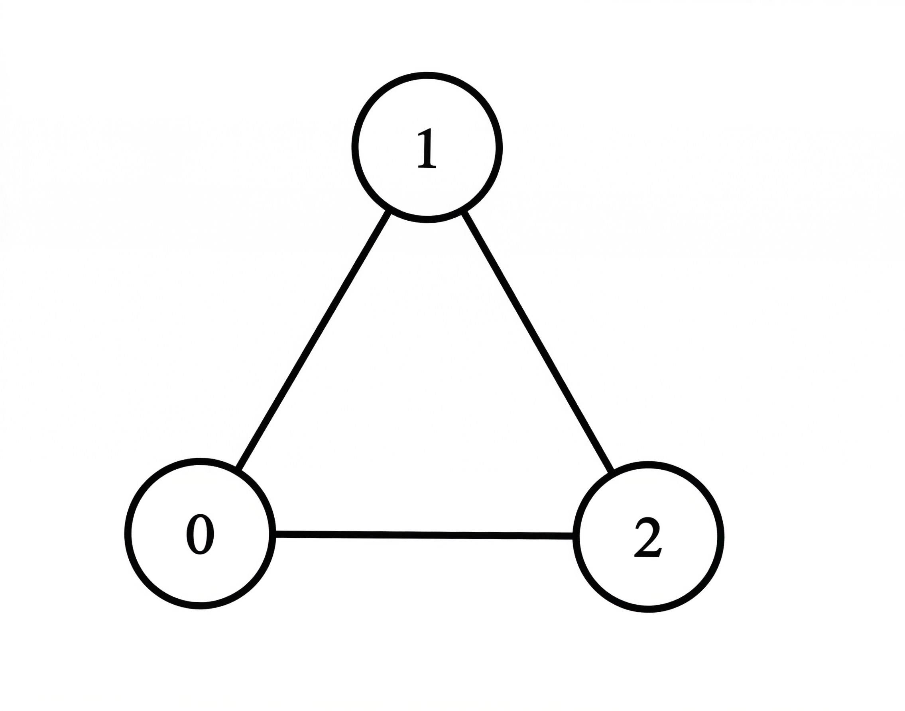
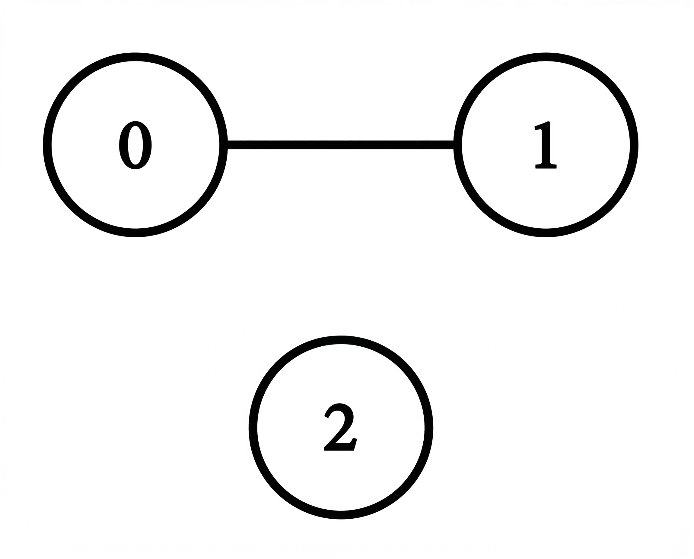

## Problem

You are given a 2D integer array matrix of size n x n representing the adjacency matrix of an undirected graph with n vertices labeled from 0 to n - 1.

matrix[i][j] = 1 indicates that there is an edge between vertices i and j.
matrix[i][j] = 0 indicates that there is no edge between vertices i and j.
The degree of a vertex is the number of edges connected to it.

Return an integer array ans of size n where ans[i] represents the degree of vertex i.

Example 1:

Input: matrix = [[0,1,1],[1,0,1],[1,1,0]]

Output: [2,2,2]

Explanation:

Vertex 0 is connected to vertices 1 and 2, so its degree is 2.

Vertex 1 is connected to vertices 0 and 2, so its degree is 2.

Vertex 2 is connected to vertices 0 and 1, so its degree is 2.

Thus, the answer is [2, 2, 2].

Example 2:

Input: matrix = [[0,1,0],[1,0,0],[0,0,0]]

Output: [1,1,0]

Explanation:

Vertex 0 is connected to vertex 1, so its degree is 1.

Vertex 1 is connected to vertex 0, so its degree is 1.

Vertex 2 is not connected to any vertex, so its degree is 0.

Thus, the answer is [1, 1, 0].

Example 3:

Input: matrix = [[0]]

Output: [0]

Explanation:

There is only one vertex and it has no edges connected to it. Thus, the answer is [0].

Constraints:

1 <= n == matrix.length == matrix[i].length <= 100​​​​​​​
​​​​​​​matrix[i][i] == 0
matrix[i][j] is either 0 or 1
matrix[i][j] == matrix[j][i]

## Approach

**Pattern used:** Matrix Traversal (Graph Representation)

### Core Idea

The matrix is an **adjacency matrix** of an undirected graph.

* `matrix[i][j] = 1` → edge exists between i and j
* Degree of vertex `i` = number of 1’s in row `i` (excluding self-loop)

---

### Step-by-step

1. **Initialize result array**

    * `ans[i]` will store degree of vertex `i`

---

2. **Traverse each row**

For each vertex `i`:

* Initialize `count = 0`

---

3. **Check connections**

For each `j`:

* If:

    * `i != j` (ignore self-loop)
    * `matrix[i][j] == 1`
* Increment count

---

4. **Store result**

* `ans[i] = count`

---

5. **Return result**

---

### Key Insights

* Each row represents all connections of a vertex
* Undirected graph → matrix is symmetric
  (`matrix[i][j] == matrix[j][i]`)
* Degree = number of neighbors

---

### Subtle Details

* You explicitly ignore `i == j`

    * Assumes no self-loops contribute to degree
* If self-loops are allowed:

    * They may count as 2 (depending on definition)

---

### Example

Matrix:
[ [0,1,1],
[1,0,0],
[1,0,0] ]

Result:

* Vertex 0 → 2
* Vertex 1 → 1
* Vertex 2 → 1

Output: [2,1,1]

---

### Edge Cases

* No edges → all degrees = 0
* Fully connected graph → degree = n-1 for each node
* Single node → degree = 0
* Self-loops present → depends on interpretation

---

## Complexity

**Time Complexity:** O(n²)

* Traverse entire matrix

---

**Space Complexity:** O(n)

* Output array

---

## Optimization

### Slight Improvement

If self-loops are guaranteed absent:

* You can remove `i != j` check

---

### Alternative Representation

If graph was given as **edge list**:

* You could compute degrees in O(E) instead of O(n²)

---

**Q1:** How would you modify this if the graph was directed (in-degree vs out-degree)?
**Q2:** What changes if self-loops count as 2 in degree calculation?
**Q3:** How would this differ if the graph was stored as an adjacency list instead?

