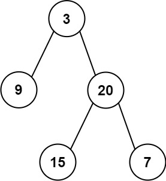

## Problem
Given the root of a binary tree, return the sum of all left leaves.

A leaf is a node with no children. A left leaf is a leaf that is the left child of another node.

Example 1:

Input: root = [3,9,20,null,null,15,7]

Output: 24

Explanation: There are two left leaves in the binary tree, with values 9 and 15 respectively.

Example 2:

Input: root = [1]

Output: 0

Constraints:

The number of nodes in the tree is in the range [1, 1000].
-1000 <= Node.val <= 1000

## Approach

The goal is to compute the **sum of all left leaf nodes** in a binary tree.

### Definitions

- **Leaf node** → a node with no left and right children
- **Left leaf** → a leaf node that is the **left child of its parent**

---

### Key Idea: DFS with State Tracking

We perform a **recursive DFS traversal** while keeping track of whether the current node is a **left child**.

We pass a boolean flag:

isLeft → true if the current node is a left child

---

### Step-by-step reasoning

1. Start recursion from the root:
   - Initial call uses `isLeft = false` (root is not a left child)

---

2. Base Case

If the node is a **leaf node**:

- If `isLeft == true`
  → add its value to sum
- Otherwise ignore it

---

3. Recursive Calls

- For left child:
  
  call with `isLeft = true`

- For right child:
  
  call with `isLeft = false`

---

4. Accumulate Sum

The sum is passed through recursion and updated whenever a left leaf is found.

---

### Why This Works

- The `isLeft` flag ensures we only count **left-side leaves**
- DFS guarantees we visit every node exactly once

---

### Important Observation (Improvement)

Passing `sum` as a parameter is **not ideal** because:

- It mixes traversal state with aggregation
- Makes reasoning harder

Cleaner approach:

Return sum from recursion instead of passing it

---

### Cleaner Version (Conceptually)

return leftSum + rightSum

---

## Complexity

### Time Complexity

O(n)

- Each node is visited once

---

### Space Complexity

O(h)

- `h` = height of the tree
- Due to recursion stack

