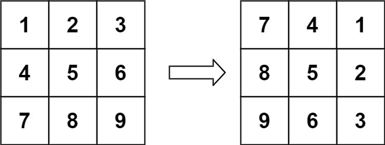
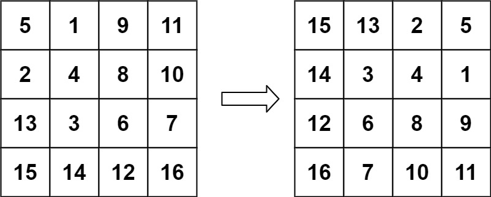

## Problem

You are given an n x n 2D matrix representing an image, rotate the image by 90 degrees (clockwise).

You have to rotate the image in-place, which means you have to modify the input 2D matrix directly. DO NOT allocate another 2D matrix and do the rotation.

Example 1:

Input: matrix = [[1,2,3],[4,5,6],[7,8,9]]

Output: [[7,4,1],[8,5,2],[9,6,3]]

Example 2:

Input: matrix = [[5,1,9,11],[2,4,8,10],[13,3,6,7],[15,14,12,16]]

Output: [[15,13,2,5],[14,3,4,1],[12,6,8,9],[16,7,10,11]]

Constraints:

n == matrix.length == matrix[i].length
1 <= n <= 20
-1000 <= matrix[i][j] <= 1000

## Approach

**Pattern used:** Matrix Layer Traversal (Ring Rotation / Simulation)

### Core Idea

You rotate the matrix **layer by layer (ring by ring)**.

For each layer:

* Extract top row into a temporary list (`carryOver`)
* Then rotate elements across 4 sides:

    1. Top → Right
    2. Right → Bottom
    3. Bottom → Left
    4. Left → Top

This simulates a **clockwise rotation** using extra storage.

---

### Step-by-step

1. **Initialize boundaries**

    * `top`, `bottom`, `left`, `right`
    * These define the current layer

---

2. **Process one layer at a time**

Loop while boundaries are valid:

* Extract **top row** into `carryOver`

---

3. **Rotate values across edges**

#### Step 1: Top → Right column

* Replace right column using `carryOver`
* Store displaced values back into `carryOver`

---

#### Step 2: Right → Bottom row

* Move values from right to bottom
* Continue cycling via `carryOver`

---

#### Step 3: Bottom → Left column

* Same idea: rotate values

---

#### Step 4: Left → Top row

* Complete the cycle

---

4. **Shrink boundaries**

* Move inward:

    * `top++`, `bottom--`, `left++`, `right--`

---

### Key Insights

* Each layer forms a **closed cycle**
* `carryOver` acts like a **buffer for cyclic swaps**
* You’re effectively rotating 4 edges in-place but using extra space

---

### Subtle Details

* Index resets (`index = 1`) are critical to align correctly
* Careful handling of boundaries avoids overwriting values
* Order of traversal matters — wrong order breaks rotation

---

### Edge Cases

* 1x1 matrix → no change
* 2x2 matrix → single layer rotation
* Odd-sized matrix → center element untouched

---

## Complexity

**Time Complexity:** O(n²)

* Every element is visited once

---

**Space Complexity:** O(n)

* `carryOver` stores one row per layer

---

## Optimization (Better Approach)
90 = transpose + reverse row
180 = reverse row + reverse column
270 = transpose + reverse col

### Optimal In-place Rotation (O(1) space)

Use **Transpose + Reverse**

1. Transpose matrix:

    * Swap `matrix[i][j]` with `matrix[j][i]`

2. Reverse each row

This achieves the same result with:

* No extra space
* Cleaner logic

---

### Why it's better

* No complex index tracking
* No extra list
* Easier to implement and debug

---

**Q1:** Why does transpose + reverse result in a 90° clockwise rotation?
**Q2:** How would you modify this approach for anti-clockwise rotation?
**Q3:** Can you perform rotation in-place by swapping 4 elements at a time without extra storage?

