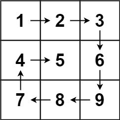
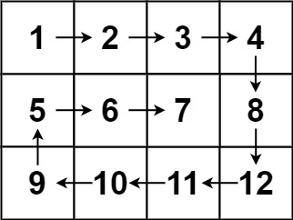

## Problem

Given an m x n matrix, return all elements of the matrix in spiral order.

Example 1:

Input: matrix = [[1,2,3],[4,5,6],[7,8,9]]

Output: [1,2,3,6,9,8,7,4,5]

Example 2:

Input: matrix = [[1,2,3,4],[5,6,7,8],[9,10,11,12]]

Output: [1,2,3,4,8,12,11,10,9,5,6,7]

Constraints:

m == matrix.length
n == matrix[i].length
1 <= m, n <= 10
-100 <= matrix[i][j] <= 100

