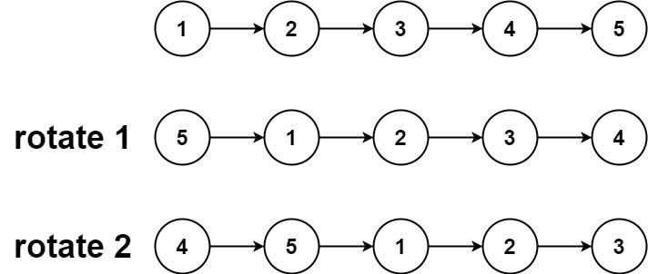
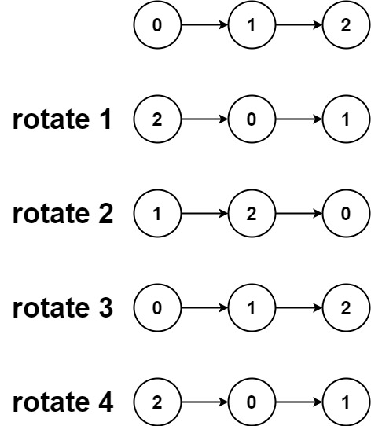

## Problem

Given the head of a linked list, rotate the list to the right by k places.

Example 1:

Input: head = [1,2,3,4,5], k = 2

Output: [4,5,1,2,3]

Example 2:

Input: head = [0,1,2], k = 4

Output: [2,0,1]

Constraints:

The number of nodes in the list is in the range [0, 500].
-100 <= Node.val <= 100
0 <= k <= 2 * 109

## Approach

**Pattern used:** Linked List + Circular Transformation

### Core Idea

Rotating the list right by `k` means:

* Move the last `k` nodes to the front

Instead of shifting nodes repeatedly, convert the list into a **circular list**, then break it at the correct position.

---

### Step-by-step

1. **Handle edge cases**

    * If `head == null` or `k == 0` → return head

---

2. **Find length and tail**

    * Traverse list to get:

        * `length`
        * `tail` (last node)

---

3. **Normalize k**

    * `k = k % length`
    * Avoid unnecessary full rotations

   👉 If `k == 0`, return head

---

4. **Make list circular**

    * `tail.next = head`
    * Now it's a loop

---

5. **Find new tail**

    * New tail is at position:
      `length - k`
    * Move from head:
      `stepsToNewTail = length - k`

---

6. **Break the circle**

* New head = `newTail.next`
* Set:
  `newTail.next = null`

---

### Example

List: 1 → 2 → 3 → 4 → 5
k = 2

* length = 5
* stepsToNewTail = 5 - 2 = 3
* newTail = 3
* newHead = 4

Result: 4 → 5 → 1 → 2 → 3

---

### Key Insights

* Converting to circular list avoids complex pointer juggling
* Problem reduces to:
  👉 "Where to break the circle?"
* `length - k` gives exact split point

---

### Subtle Details

* Length starts at 1 because tail starts at head
* Loop runs `stepsToNewTail - 1` times → correct positioning
* Breaking the cycle is critical to avoid infinite loop

---

### Edge Cases

* k > length → handled via modulo
* k = multiple of length → no change
* Single node → unchanged
* Empty list → unchanged

---

## Complexity

**Time Complexity:** O(n)

* One pass to find length
* One pass to find new tail

---

**Space Complexity:** O(1)

* In-place modification

---

## Optimization

This is already optimal:

* No extra space
* Only linear traversal

Alternative (less efficient):

* Move last node to front k times → O(n × k)

---

**Q1:** Why does making the list circular simplify this problem significantly?
**Q2:** How would you rotate the list to the left instead of right?
**Q3:** Can you solve this using two pointers without explicitly forming a cycle?

