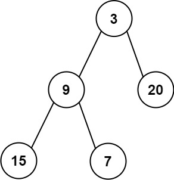

## Problem

Given the root of a binary tree, return the average value of the nodes on each level in the form of an array. Answers within 10-5 of the actual answer will be accepted.

Example 1:

Input: root = [3,9,20,null,null,15,7]
Output: [3.00000,14.50000,11.00000]
Explanation: The average value of nodes on level 0 is 3, on level 1 is 14.5, and on level 2 is 11.
Hence return [3, 14.5, 11].

Example 2:

Input: root = [3,9,20,15,7]
Output: [3.00000,14.50000,11.00000]

Constraints:

The number of nodes in the tree is in the range [1, 104].
-231 <= Node.val <= 231 - 1

## Approach

We use Breadth-First Search (BFS) with a queue to process the tree level by level.

Algorithm:

1. Initialize a queue and add the root node.
2. While the queue is not empty:
    - Get the current level size (`n = queue.size()`).
    - Initialize `sum = 0`.
    - Process all `n` nodes in this level:
        - Remove node from queue.
        - Add its value to `sum`.
        - Add its left and right children to the queue if they exist.
    - After processing the level, compute:
      average = sum / n
    - Add the average to the result list.
3. Return the result list.

We calculate the average separately for each level.

## Complexity
Time: O(n)
Each node is visited exactly once.

Space: O(n)
In the worst case (complete binary tree),
the queue may store up to n/2 nodes at the last level.

