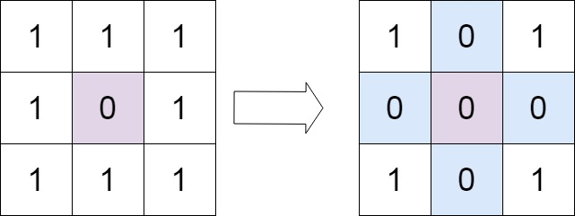
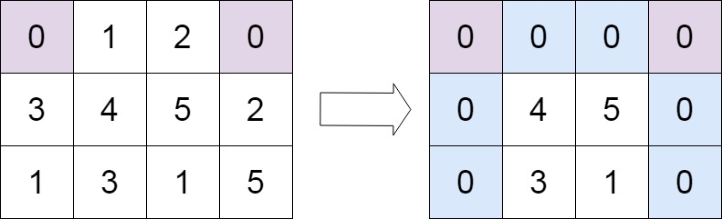

## Problem

Given an m x n integer matrix matrix, if an element is 0, set its entire row and column to 0's.

You must do it in place.

Example 1:

Input: matrix = [[1,1,1],[1,0,1],[1,1,1]]

Output: [[1,0,1],[0,0,0],[1,0,1]]

Example 2:

Input: matrix = [[0,1,2,0],[3,4,5,2],[1,3,1,5]]

Output: [[0,0,0,0],[0,4,5,0],[0,3,1,0]]

Constraints:

m == matrix.length
n == matrix[0].length
1 <= m, n <= 200
-231 <= matrix[i][j] <= 231 - 1

Follow up:

A straightforward solution using O(mn) space is probably a bad idea.
A simple improvement uses O(m + n) space, but still not the best solution.
Could you devise a constant space solution?

# Set Matrix Zeroes

## Approach

**Pattern used:** In-place Matrix Marking

---

## Core Idea

If any cell contains `0`:

* its entire row becomes `0`
* its entire column becomes `0`

Naive approach:

* store rows and columns separately
* extra O(m + n) space

Better approach:

* reuse the matrix itself as marker storage

Specifically:

* first row stores column markers
* first column stores row markers

This reduces extra space to O(1).

---

# Step-by-step

## 1. Handle first row and first column separately

Why needed?

Because:

* first row and first column are being used as markers
* we would lose their original information

So first detect:

* does first row already contain `0`
* does first column already contain `0`

Stored in:

boolean firstRowHasZero
boolean firstColHasZero

---

## 2. Mark rows and columns

Traverse remaining matrix:

for (r = 1 → rows-1)
for (c = 1 → cols-1)

If:

matrix[r][c] == 0

then mark:

matrix[r][0] = 0
matrix[0][c] = 0

Meaning:

* row `r` must become zero
* column `c` must become zero

---

## 3. Zero marked rows

If:

matrix[r][0] == 0

then zero entire row.

---

## 4. Zero marked columns

If:

matrix[0][c] == 0

then zero entire column.

---

## 5. Finally handle first row/column

Use saved booleans:

* firstRowHasZero
* firstColHasZero

to zero them if necessary.

---

# Why this works

The first row and column act like hash sets:

* row marker
* column marker

No extra arrays needed.

Example:

Initial:

1 1 1
1 0 1
1 1 1

After marking:

1 0 1
0 0 1
1 1 1

Now:

* row 1 marked
* column 1 marked

Then final transformation becomes:

1 0 1
0 0 0
1 0 1

---

# Important Insight

This is the key trick:

matrix[r][0] = 0
matrix[0][c] = 0

You are encoding future operations directly inside matrix memory.

Classic in-place optimization.

---

# Complexity

## Time Complexity

Two full matrix traversals:

O(m \times n)

---

## Space Complexity

Only booleans used:

O(1)

---

# Common Mistake

If you immediately zero rows/columns while traversing:

* newly written zeroes incorrectly spread further

That corrupts the result.

So:

1. mark first
2. apply later

is essential.

---

# Final Take

This is the optimal interview solution:

* O(m × n)
* O(1) extra space
* elegant in-place marking trick

Very important matrix problem.

---

**Q1:** Why must row/column updates happen after marking instead of immediately?
**Q2:** Why are first row and first column special cases?
**Q3:** How would you solve this using bitsets for extremely large sparse matrices?
