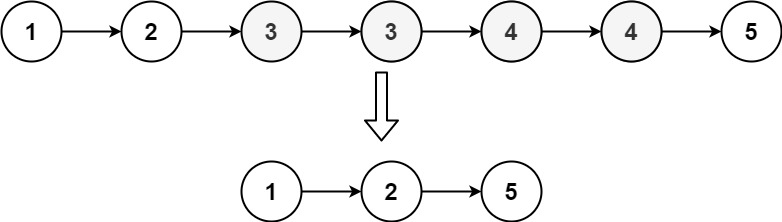
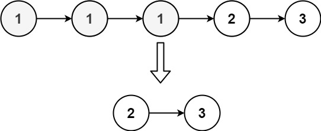

## Problem

Given the head of a sorted linked list, delete all nodes that have duplicate numbers, leaving only distinct numbers from the original list. Return the linked list sorted as well.

Example 1:

Input: head = [1,2,3,3,4,4,5]

Output: [1,2,5]

Example 2:

Input: head = [1,1,1,2,3]

Output: [2,3]

Constraints:

The number of nodes in the list is in the range [0, 300].
-100 <= Node.val <= 100
The list is guaranteed to be sorted in ascending order.

## Approach

**Pattern used:** Linked List Traversal + Two Pointers (Skip Duplicates)

### Core Idea

You need to **remove all nodes that have duplicates**, not just deduplicate.

So:

* If a value appears more than once → remove all its occurrences
* Only keep values that appear exactly once

---

### Step-by-step

1. **Use dummy node**

    * `start → head`
    * Helps build the result list cleanly

2. **Initialize pointers**

    * `left` → builds the result list
    * `right` → traverses the input list

---

3. **Traverse list**

For each group of same values:

* Store current value: `currentValue = right.val`
* Count duplicates:

    * Move `right` forward while next node has same value
    * Increment `count`

---

4. **Handle two cases**

### Case 1: Duplicates found (count > 0)

* Skip entire group
* Move `right` forward
* Do NOT link anything to `left`

👉 This removes all occurrences

---

### Case 2: Unique value (count == 0)

* Link node:
  `left.next = right`
* Move `left` forward
* Move `right` forward

---

5. **Terminate list**

* `left.next = null`
* Prevents leftover links

---

6. **Return result**

* `start.next`

---

### Key Insights

* You process **groups of equal values**, not individual nodes
* The `count` tells whether to keep or discard
* Only nodes with **no duplicates survive**
* This is different from "remove duplicates" (which keeps one copy)

---

### Subtle Details

* You correctly isolate duplicate groups:
  `temp.next = null` → avoids accidental linking
* Important to move `right` AFTER skipping duplicates
* Final `left.next = null` avoids trailing garbage links

---

### Edge Cases

* All nodes are duplicates → return empty list
* No duplicates → return original list
* Duplicates at start → handled via dummy node
* Single node → always kept

---

## Complexity

**Time Complexity:** O(n)

* Each node visited once

---

**Space Complexity:** O(1)

* No extra space used (in-place manipulation)

---

## Optimization / Cleaner Approach

You can simplify logic by:

* Using `prev` pointer
* Checking `prev.next != current` to detect duplicates without explicit count

This removes the need for `count` and makes code cleaner.

---

**Q1:** How would you modify this to keep one instance of duplicates instead of removing all?
**Q2:** Can you solve this recursively while maintaining O(n) time?
**Q3:** Why is explicitly breaking links (`temp.next = null`) sometimes important in linked list problems?

