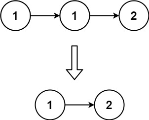
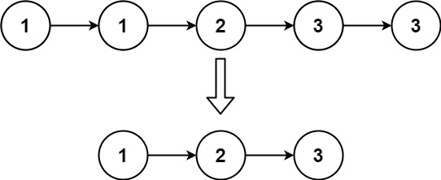

## Problem

Given the head of a sorted linked list, delete all duplicates such that each element appears only once. Return the linked list sorted as well.

Example 1:

Input: head = [1,1,2]

Output: [1,2]

Example 2:

Input: head = [1,1,2,3,3]

Output: [1,2,3]

Constraints:

The number of nodes in the list is in the range [0, 300].
-100 <= Node.val <= 100
The list is guaranteed to be sorted in ascending order.

## Approach

**Pattern used:** Linked List Traversal (In-place Deduplication)

### Core Idea

This problem removes **duplicate nodes but keeps one instance** of each value.

Since the list is **sorted**, duplicates will always be **adjacent**, which allows simple in-place removal.

---

### Step-by-step

1. **Start from head**

    * Use pointer `current = head`

---

2. **Traverse the list**

While:
`current != null && current.next != null`

Check:

### Case 1: Duplicate found

* If `current.val == current.next.val`
* Skip the next node:
  `current.next = current.next.next`

👉 This removes the duplicate node

---

### Case 2: No duplicate

* Move forward:
  `current = current.next`

---

3. **Return head**

* List is modified in-place

---

### Key Insights

* Sorting is what makes this simple:
  👉 duplicates are always next to each other
* No extra memory needed
* Pointer manipulation is minimal and efficient

---

### Subtle Details

* Do NOT move `current` when deleting

    * Because there might be multiple duplicates in a row
* Only move forward when values differ

---

### Example

Input:
1 → 1 → 2 → 3 → 3

Process:

* Remove second 1
* Move to 2
* Remove second 3

Output:
1 → 2 → 3

---

### Edge Cases

* Empty list → return null
* Single node → unchanged
* All duplicates → reduced to one node
* No duplicates → unchanged

---

## Complexity

**Time Complexity:** O(n)

* Each node is visited once

---

**Space Complexity:** O(1)

* In-place modification

---

## Optimization

Already optimal:

* Single pass
* Constant space

No better approach exists due to need to inspect each node.

---

**Q1:** Why does this approach fail if the list is not sorted?
**Q2:** How would you remove all duplicates completely (not keep one)?
**Q3:** Can this be solved using recursion, and what would change?

