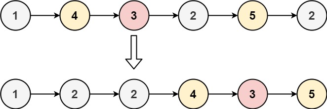

## Problem

Given the head of a linked list and a value x, partition it such that all nodes less than x come before nodes greater than or equal to x.

You should preserve the original relative order of the nodes in each of the two partitions.

Example 1:

Input: head = [1,4,3,2,5,2], x = 3

Output: [1,2,2,4,3,5]

Example 2:

Input: head = [2,1], x = 2

Output: [1,2]

Constraints:

The number of nodes in the list is in the range [0, 200].
-100 <= Node.val <= 100
-200 <= x <= 200

# Approach

**Pattern used:** Linked List Partitioning using Two Lists

### Core Idea

The goal is to rearrange the linked list so that:

* All nodes with values less than `x` appear first.
* All nodes with values greater than or equal to `x` appear afterward.
* The relative order within each group is preserved.

The solution creates two separate linked lists while traversing the original list:

1. A "less" list for values `< x`
2. A "greater" list for values `>= x`

After processing all nodes, the two lists are connected together.

---

### Step-by-Step

#### 1. Create Dummy Heads

Two dummy nodes simplify list construction:

lessHead
greaterHead

They avoid special handling for the first insertion.

---

#### 2. Traverse the Original List

For each node:

##### If value < x

Append it to the "less" list.

Example:

x = 3

Node = 1

less:

1

---

##### If value >= x

Append it to the "greater" list.

Example:

Node = 4

greater:

4

---

#### 3. Preserve Relative Order

Nodes are appended at the tail of their respective list.

Therefore:

1 → 2 → 2

remains:

1 → 2 → 2

inside the "less" partition.

Likewise for the "greater" partition.

---

#### 4. Join the Two Lists

After traversal:

less.next = greaterHead.next

This connects:

less-list → greater-list

---

#### 5. Return Result

The actual head is:

lessHead.next

since `lessHead` is only a dummy node.

### Example

Input:

1 → 4 → 3 → 2 → 5 → 2

x = 3

Build:

less:

1 → 2 → 2

greater:

4 → 3 → 5

Connect:

1 → 2 → 2 → 4 → 3 → 5

Return:

1 → 2 → 2 → 4 → 3 → 5

### Key Insights

#### 1. Two Lists Make Partitioning Easy

Instead of inserting nodes in the middle of a list, simply collect them into two groups.

#### 2. Order Is Naturally Preserved

Appending to the tail maintains the original order within each partition.

#### 3. Dummy Nodes Simplify Logic

Without dummy nodes, special cases would be needed for empty partitions.

### Subtle Detail

This solution creates entirely new nodes:

new ListNode(head.val)

rather than reusing existing nodes.

Because of this:

* Original list remains unchanged.
* Extra memory is used for all nodes.

Many optimal solutions reuse the existing nodes instead of creating copies.

# Complexity

**Time Complexity:** O(n)

* Every node is visited exactly once.

**Space Complexity:** O(n)

* A new node is created for every original node.

Overall auxiliary space: O(n).

# Complexity

**Time Complexity:** O(n)

* Every node is visited exactly once.

**Space Complexity:** O(n)

* A new node is created for every original node.

Overall auxiliary space: O(n).
