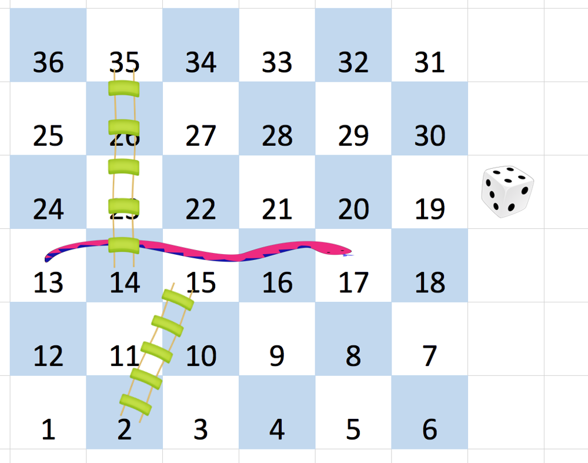

## Problem

You are given an n x n integer matrix board where the cells are labeled from 1 to n2 in a Boustrophedon style starting from the bottom left of the board (i.e. board[n - 1][0]) and alternating direction each row.

You start on square 1 of the board. In each move, starting from square curr, do the following:

Choose a destination square next with a label in the range [curr + 1, min(curr + 6, n2)].
This choice simulates the result of a standard 6-sided die roll: i.e., there are always at most 6 destinations, regardless of the size of the board.
If next has a snake or ladder, you must move to the destination of that snake or ladder. Otherwise, you move to next.
The game ends when you reach the square n2.
A board square on row r and column c has a snake or ladder if board[r][c] != -1. The destination of that snake or ladder is board[r][c]. Squares 1 and n2 are not the starting points of any snake or ladder.

Note that you only take a snake or ladder at most once per dice roll. If the destination to a snake or ladder is the start of another snake or ladder, you do not follow the subsequent snake or ladder.

For example, suppose the board is [[-1,4],[-1,3]], and on the first move, your destination square is 2. You follow the ladder to square 3, but do not follow the subsequent ladder to 4.
Return the least number of dice rolls required to reach the square n2. If it is not possible to reach the square, return -1.

Example 1:

Input: board = [[-1,-1,-1,-1,-1,-1],[-1,-1,-1,-1,-1,-1],[-1,-1,-1,-1,-1,-1],[-1,35,-1,-1,13,-1],[-1,-1,-1,-1,-1,-1],[-1,15,-1,-1,-1,-1]]
Output: 4
Explanation:
In the beginning, you start at square 1 (at row 5, column 0).
You decide to move to square 2 and must take the ladder to square 15.
You then decide to move to square 17 and must take the snake to square 13.
You then decide to move to square 14 and must take the ladder to square 35.
You then decide to move to square 36, ending the game.
This is the lowest possible number of moves to reach the last square, so return 4.

Example 2:

Input: board = [[-1,-1],[-1,3]]
Output: 1

Constraints:

n == board.length == board[i].length
2 <= n <= 20
board[i][j] is either -1 or in the range [1, n2].
The squares labeled 1 and n2 are not the starting points of any snake or ladder.

## Approach

This problem models the **Snakes and Ladders board as a graph** where:

- Each square represents a **node**.
- From any square `x`, you can move to **x + 1 ... x + 6** depending on the dice roll.
- If the destination square contains a **snake or ladder**, you must move to the indicated square.

The task is to find the **minimum number of dice rolls** required to reach the final square.

### Key Idea: Breadth-First Search (BFS)

Since every dice roll represents **one move with equal cost**, the optimal strategy is **BFS**, which finds the shortest path in an unweighted graph.

### Step 1 — Convert board coordinates

The board uses a **zigzag numbering pattern**:

- Numbers increase from **bottom-left to bottom-right**.
- The next row goes **right-to-left**, alternating direction.

To translate a cell number `t` into `(row, col)`:

row = (t - 1) / n  
col = (t - 1) % n

Then adjust for the zigzag pattern and inverted board indexing:

board[n - 1 - row][row % 2 == 1 ? n - 1 - col : col]

If the board value is not `-1`, it means a **snake or ladder jump exists**, so the destination becomes that value.

### Step 2 — BFS traversal

1. Start from square `1`.
2. Use a queue to explore all reachable positions.
3. Maintain an array `minRolls[]` storing the minimum dice rolls required to reach each square.

For each position `x`:

- Try all dice rolls `1 → 6`.
- Compute the tentative position `t = x + i`.
- Determine the actual destination `y` after snake/ladder.

### Step 3 — Visit new nodes

If `y` has not been visited:

- Update:

minRolls[y] = minRolls[x] + 1

- Push `y` into the queue.

### Step 4 — Early termination

If `y == n²`, we reached the final square, so return the number of rolls.

### Why BFS Works

Each dice roll represents a **uniform edge weight (1)**.  
BFS guarantees the **minimum number of moves** to reach the target.

---

## Complexity

### Time Complexity
O(n²)

Each board cell is visited at most once, and each visit explores up to **6 possible dice moves**.

### Space Complexity
O(n²)

- `minRolls` array stores values for all board cells.
- The BFS queue may also hold up to `n²` elements.

