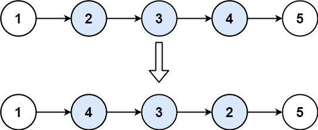

## Problem

Given the head of a singly linked list and two integers left and right where left <= right, reverse the nodes of the list from position left to position right, and return the reversed list.

Example 1:

Input: head = [1,2,3,4,5], left = 2, right = 4
Output: [1,4,3,2,5]
Example 2:

Input: head = [5], left = 1, right = 1
Output: [5]

Constraints:

The number of nodes in the list is n.
1 <= n <= 500
-500 <= Node.val <= 500
1 <= left <= right <= n

Follow up: Could you do it in one pass?

## Approach

The goal is to **reverse a portion of a singly linked list** between positions `left` and `right` (1-indexed) while keeping the rest of the list unchanged.

### Key Idea

Break the list into three parts:

1. **Prefix** → nodes before position `left`
2. **Sublist** → nodes between `left` and `right` (this part gets reversed)
3. **Suffix** → nodes after position `right`

After reversing the middle segment, reconnect these three parts.

---

### Step 1 — Move to the `left` position

Traverse the list until reaching the node at position `left`.

During traversal:

- `leftHead` stores the node **before the sublist**.
- `currentNode` points to the **first node of the sublist**.

We also decrease `left` and `right` during traversal so that `right` represents the remaining length of the section to reverse.

---

### Step 2 — Reverse the sublist

Use the standard **linked list reversal technique**.

Maintain:

- `prev` → previous node in the reversed list
- `currentNode` → current node being processed

Reverse nodes until reaching the `right` boundary.

`tail` stores the **original first node of the sublist**, which becomes the **tail after reversal**.

---

### Step 3 — Reconnect the list

After the reversal:

- `tail.next` connects to the **first node after the reversed section**
- `currentNode` becomes the **new head of the reversed sublist**

Then reconnect:

- If `leftHead` exists  
  connect `leftHead.next → currentNode`
- Otherwise, the reversed section starts at the head, so return `currentNode`.

---

### Result

The list structure becomes:

prefix → reversed sublist → suffix

without creating extra nodes.

---

## Complexity

### Time Complexity
O(n)

In the worst case we traverse the list once.

### Space Complexity
O(1)

The reversal is done **in-place** using a constant number of pointers.

