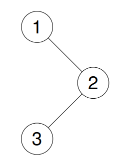
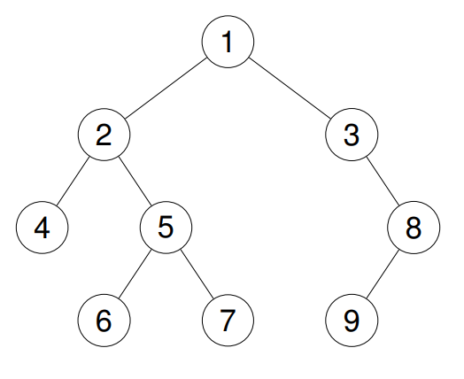

## Problem

Given the root of a binary tree, return the inorder traversal of its nodes' values.

Example 1:

Input: root = [1,null,2,3]

Output: [1,3,2]

Explanation:

Example 2:

Input: root = [1,2,3,4,5,null,8,null,null,6,7,9]

Output: [4,2,6,5,7,1,3,9,8]

Explanation:

Example 3:

Input: root = []

Output: []

Example 4:

Input: root = [1]

Output: [1]

Constraints:

The number of nodes in the tree is in the range [0, 100].
-100 <= Node.val <= 100

Follow up: Recursive solution is trivial, could you do it iteratively?

## Approach 1

We use Depth-First Search (DFS) recursion.

Inorder traversal follows this order:

    1. Traverse left subtree
    2. Visit current node
    3. Traverse right subtree

Algorithm:
- If node is null → return.
- Recursively traverse left subtree.
- Add current node value to result.
- Recursively traverse right subtree.

This guarantees nodes are processed in sorted order
for a Binary Search Tree (BST).

## Complexity 1
Time: O(n)
Each node is visited exactly once.

Space: O(h)
Where h is the height of the tree.
Worst case (skewed tree): O(n)
Balanced tree: O(log n)

## Approach 2 (Iterative – Using Stack)

We simulate recursion manually using a stack.

Inorder traversal order:
Left → Node → Right

Algorithm:

1. Initialize an empty stack.
2. While `root != null` OR stack is not empty:
   a) Go as far left as possible:
   - Push current node onto stack.
   - Move to root.left.
   b) When no more left children:
   - Pop a node from stack.
   - Add its value to result.
   - Move to its right child.
3. Repeat until both root is null and stack is empty.

The stack keeps track of nodes whose left subtree
has been processed but not yet visited.

## Complexity 2
Time: O(n)
Each node is pushed and popped exactly once.

Space: O(h)
Where h is the height of the tree.
Worst case (skewed tree): O(n)
Balanced tree: O(log n)

